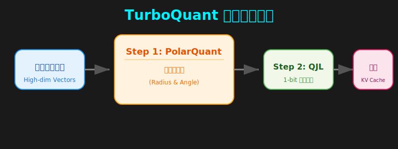

# 🚀 TurboQuant 簡介

[🏠 返回目錄](../index.md)

本文旨在深入淺出地解析 Google 最新提出的 **TurboQuant** 技術。這項技術透過極致的量化演算法，重新定義了大型語言模型（LLM）在處理長上下文（Long Context）時的記憶體效率與運算速度。

---

## 📌 核心技術概述

TurboQuant 是一種針對 **KV Cache**（鍵值快取）與**向量搜尋**（Vector Search）設計的壓縮演算法。其核心目標是在**不損失模型準確度**的前提下，大幅降低記憶體占用，並提升推理速度。

### 🛠️ 運作流程圖

以下展示了 TurboQuant 從原始高維向量到極致壓縮 KV Cache 的處理流程：

---

*Last Updated: 2026-04-10*
