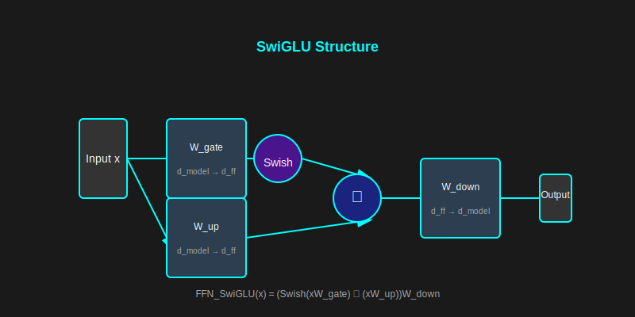

# 2.3 前饋神經網路 (Feed-Forward Neural Network, FFN)

[🏠 返回目錄](../index.md)

在 Transformer 架構中，每個 Encoder 和 Decoder 層都包含一個**前饋神經網路 (Feed-Forward Neural Network, FFN)**。Attention 機制處理 token 間的全局關係，而 FFN 則對每個位置的表示執行非線性轉換及特徵提取。

## 1. FFN 的基本結構

Transformer 中的 FFN 是一個**位置感知型 (Position-wise)** 全連接層。這表示 FFN 對序列中的每個 token $x_i$ 獨立地應用相同的轉換操作。

### 1.1 經典結構 (ReLU FFN)

一個典型的經典 FFN 由兩個線性變換和一個非線性激活函數組成：

$$
\text{FFN}(x) = \max(0, xW_1 + b_1)W_2 + b_2
$$

其中：
- $x \in \mathbb{R}^{d_{\text{model}}}$：輸入向量
- $W_1 \in \mathbb{R}^{d_{\text{model}} \times d_{\text{ff}}}$：擴展層權重矩陣
- $b_1 \in \mathbb{R}^{d_{\text{ff}}}$：擴展層偏置向量
- $W_2 \in \mathbb{R}^{d_{\text{ff}} \times d_{\text{model}}}$：壓縮層權重矩陣
- $b_2 \in \mathbb{R}^{d_{\text{model}}}$：壓縮層偏置向量
- $\max(0, \cdot)$：ReLU 激活函數

#### 參數計算

FFN 的總參數量可計算為：
$$
\text{Params} = d_{\text{model}} \cdot d_{\text{ff}} + d_{\text{ff}} + d_{\text{ff}} \cdot d_{\text{model}} + d_{\text{model}} = 2 \cdot d_{\text{model}} \cdot d_{\text{ff}} + d_{\text{model}} + d_{\text{ff}}
$$

在原始 Transformer 論文中，$d_{\text{model}} = 512$，$d_{\text{ff}} = 2048$，因此 FFN 的參數量約佔總參數的 60% 以上。

### 1.2 現代變體 (SwiGLU FFN)

現代大型語言模型（如 Llama 系列）通常採用 SwiGLU (Swapped Gated Linear Unit) 結構。此結構將傳統的擴展層拆分為兩個並行分支，並引入門控機制 (Gating Mechanism)，其定義為：

$$
\text{FFN}_{\text{SwiGLU}}(x) = (\text{Swish}(xW_{\text{gate}}) \otimes (xW_{\text{up}}))W_{\text{down}}
$$

其中：
- **$W_{\text{gate}} \in \mathbb{R}^{d_{\text{model}} \times d_{\text{ff}}}$**：與輸入進行投影，負責生成門控值以調控信息流。
- **$W_{\text{up}} \in \mathbb{R}^{d_{\text{model}} \times d_{\text{ff}}}$**：將特徵映射至高維空間的投影矩陣。
- **$\otimes$**：表示元素級乘法 (Element-wise product)。
- **$\text{Swish}(x) = x \cdot \sigma(x)$**：Swish 激活函數，其中 $\sigma(x)$ 為 Sigmoid 函數。
- **$W_{\text{down}} \in \mathbb{R}^{d_{\text{ff}} \times d_{\text{model}}}$**：負責將高維特徵壓縮回原始維度的投影矩陣。

#### SwiGLU 的優勢

1. **門控機制**：透過動態選擇特徵，顯著提升模型的表達能力。
2. **無偏置設計**：有效減少模型參數量，進而提升訓練效率。
3. **Swish 激活函數**：相較於 ReLU，Swish 函數更平滑，有助於更穩定的梯度傳播。

### 1.3 RMSNorm 與殘差連接

FFN 通常與 RMSNorm 正規化和殘差連接 (Residual Connection) 結合，共同構成完整的 Transformer 層：

$$
x_{\text{out}} = x + \text{FFN}(\text{RMSNorm}(x))
$$

其中 RMSNorm 定義為：

$$
\text{RMSNorm}(x) = \frac{x}{\text{RMS}(x)} \odot g, \quad \text{RMS}(x) = \sqrt{\frac{1}{n} \sum_{i=1}^{n} x_i^2}
$$

## 2. 為什麼需要 FFN？

若 Transformer 僅由 Attention 層構成，模型將局限於對輸入向量執行加權平均（線性組合）。FFN 的引入則賦予了模型以下關鍵能力：

### 2.1 非線性能力 (Non-linearity)

激活函數允許模型學習複雜的非線性映射，這是處理自然語言複雜語義的基礎。

### 2.2 特徵擴展與壓縮 (Expansion & Compression)

- **擴展層 ($W_1$ / $W_{\text{up}}$)**：將特徵投影到更高維的空間（通常 $d_{\text{ff}} = 4 \times d_{\text{model}}$），讓模型能更精細地分離特徵。
- **壓縮層 ($W_2$ / $W_{\text{down}}$)**：將提取後的特徵重新整合回原始維度，以便傳遞給下一層。

### 2.3 知識儲存 (Knowledge Storage)

研究指出，FFN 層在大型語言模型 (LLMs) 中扮演著類似「鍵值記憶體 (Key-Value Memory)」的角色，負責儲存大量事實性知識。當模型需要特定資訊時，FFN 層會被激活以提取相關知識。

## 3. 視覺化結構

- **輸入層** $\to$ **擴展層 (Up-projection)** $\to$ **激活函數 (Activation)** $\to$ **壓縮層 (Down-projection)** $\to$ **輸出層**

### 3.1 SwiGLU 結構圖

## 4. 與 TurboQuant 的關聯

在 TurboQuant 的量化流程中，FFN 的權重矩陣 $W_1$、$W_2$（或 SwiGLU 中的 $W_{\text{gate}}$、$W_{\text{up}}$、$W_{\text{down}}$）佔據了模型參數的絕大部分。因此，對這些矩陣進行高效量化（例如利用 PolarQuant 或 QJL）能顯著降低模型權重對記憶體的佔用，同時在推理時保持精準度。

### 4.1 量化挑戰

FFN 層的量化過程面臨以下挑戰：

1. **高維度特徵**：通常 $d_{\text{ff}}$ 維度高達 4096 甚至更高，這可能導致量化誤差累積。
2. **動態範圍廣**：不同神經元的激活值範圍存在顯著差異，因此需要自適應的量化策略。
3. **非均勻分佈**：神經元權重常呈現長尾分佈，傳統的均勻量化方法可能效果不佳。

### 4.2 PolarQuant 的應用

PolarQuant 透過極座標變換，將 FFN 權重矩陣轉換到極座標系統，然後對半徑和角度進行分離量化：

$$
W = R \odot \exp(i\Theta)
$$

其中：
- $R$：半徑矩陣，代表權重的大小
- $\Theta$：角度矩陣，代表權重的方向
- $\odot$：元素級乘法

這種分離量化方式能更精確地保留權重的結構資訊。

### 4.3 QJL 的應用

Johnson-Lindenstrauss Lemma (QJL) 提供了一種低維嵌入方法，能在保持向量間距離關係的前提下，大幅降低維度：

$$
\| \mathbf{u} - \mathbf{v} \|_2 \leq (1 + \epsilon) \| \mathbf{u}' - \mathbf{v}' \|_2
$$

透過 QJL，FFN 的高維權重矩陣可以被壓縮到更低維度，同時保持模型性能。

### 4.4 量化誤差分析

FFN 量化誤差主要來自兩個方面：

1. **權重量化誤差**：$\Delta W = W - \hat{W}$
2. **激活量化誤差**：$\Delta x = x - \hat{x}$

總誤差可表示為：

$$
\text{Error} = \| (x + \Delta x)(W + \Delta W) - xW \|_2
$$

透過優化的量化策略，可以將此誤差控制在可接受範圍內。

## 5. 總結

FFN 是 Transformer 架構中不可或缺的組成部分，它提供了非線性轉換能力，使模型能學習複雜的語義關係。在 TurboQuant 的量化過程中，FFN 的高效量化是降低模型大小和提升推理速度的關鍵。
