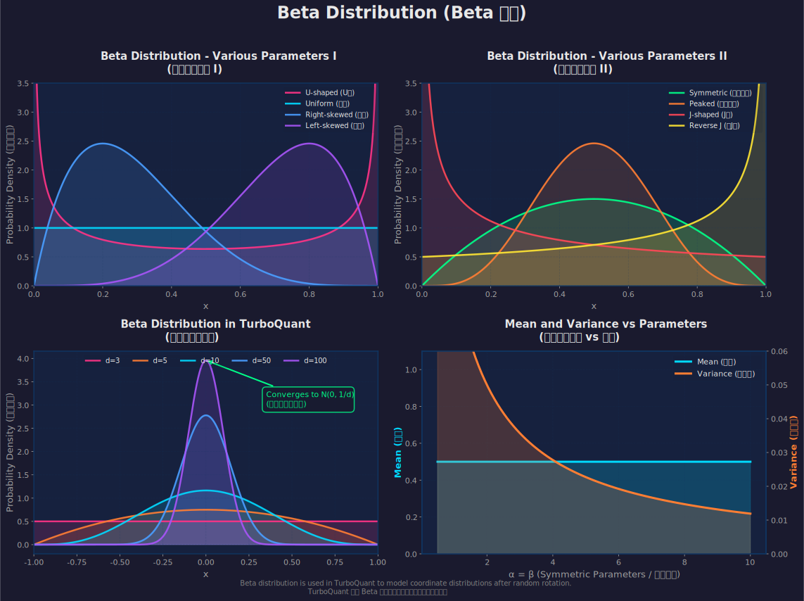

# Beta Distribution (Beta 分佈) 詳細解析

> **相關文件：** 本文是針對 [`03-turboquant-translation.md`](03-turboquant-translation.md) 中提到的 Beta distribution 概念的補充說明。
>
> **返回連結：** [回到 TurboQuant 論文翻譯](03-turboquant-translation.md)

---

## 1. 什麼是 Beta Distribution？

**Beta Distribution（Beta 分佈）** 是一種連續機率分佈，定義在區間 $[0, 1]$ 上（或在某些應用中定義在 $[-1, 1]$ 上），由兩個形狀參數 $\alpha$ 和 $\beta$ 控制。

### 1.1 數學定義

Beta distribution 的機率密度函數（Probability Density Function, PDF）定義為：

$$
f(x; \alpha, \beta) = \frac{1}{B(\alpha, \beta)} x^{\alpha-1} (1-x)^{\beta-1}, \quad x \in [0, 1]
$$

其中：
- $\alpha > 0$ 和 $\beta > 0$ 是形狀參數（shape parameters）
- $B(\alpha, \beta)$ 是 Beta 函數，作為歸一化常數：

$$
B(\alpha, \beta) = \int_0^1 t^{\alpha-1} (1-t)^{\beta-1} dt = \frac{\Gamma(\alpha)\Gamma(\beta)}{\Gamma(\alpha+\beta)}
$$

這裡 $\Gamma(\cdot)$ 是 Gamma 函數。

### 1.2 基本統計特性

| 特性 | 公式 |
|------|------|
| **均值（Mean）** | $\displaystyle \mu = \frac{\alpha}{\alpha + \beta}$ |
| **變異數（Variance）** | $\displaystyle \sigma^2 = \frac{\alpha\beta}{(\alpha+\beta)^2(\alpha+\beta+1)}$ |
| **眾數（Mode）** | $\displaystyle \frac{\alpha-1}{\alpha+\beta-2}$ (當 $\alpha, \beta > 1$) |
| **偏度（Skewness）** | $\displaystyle \frac{2(\beta-\alpha)\sqrt{\alpha+\beta+1}}{(\alpha+\beta+2)\sqrt{\alpha\beta}}$ |

---

## 2. Beta Distribution 的形狀變化

Beta distribution 的形狀完全由參數 $\alpha$ 和 $\beta$ 決定，可以呈現多種不同的形態：

### 2.1 不同參數組合的形狀

| 參數 $(\alpha, \beta)$ | 形狀描述 | 應用場景 |
|------------------------|----------|----------|
| $(0.5, 0.5)$ | **U 型分佈** | 雙峰分佈 |
| $(1, 1)$ | **均勻分佈** | 完全隨機 |
| $(2, 5)$ | **右偏分佈** | 大部分值接近 0 |
| $(5, 2)$ | **左偏分佈** | 大部分值接近 1 |
| $(2, 2)$ | **對稱鐘型** | 類似常態分佈 |
| $(5, 5)$ | **對稱尖峰** | 高度集中在 0.5 |
| $(0.5, 1)$ | **J 型分佈** | 極端值在 0 |
| $(1, 0.5)$ | **反 J 型分佈** | 極端值在 1 |

### 2.2 可視化圖表

下圖展示了不同參數組合下的 Beta distribution 機率密度函數：

**圖表說明：**
- **左上圖**：展示了 U 型、均勻、右偏、左偏分佈
- **右上圖**：展示了對稱、尖峰、J 型、反 J 型分佈
- **左下圖**：展示了 TurboQuant 中使用的 Beta distribution 在不同維度下的變化
- **右下圖**：展示了均值和變異數隨參數變化的趨勢

---

## 3. Beta Distribution 在 TurboQuant 中的應用

在 TurboQuant 論文中，Beta distribution 扮演著核心角色。讓我們深入理解其應用。

### 3.1 隨機旋轉後的座標分佈

TurboQuant 的核心思想是對輸入向量進行隨機旋轉。關鍵觀察是：

> **引理 1**（超球面上隨機點的座標分佈）。對於任何正整數 $d$，如果 $\mathbf{x}\in\mathbb{S}^{d-1}$ 是在單位超球面上均勻分佈的隨機變量，那麼對於任何 $j\in[d]$，座標 $\mathbf{x}_j$ 遵循以下 Beta 分佈：

$$
\mathbf{x}_j \sim f_X(x) := \frac{\Gamma(d/2)}{\sqrt{\pi}\cdot\Gamma((d-1)/2)}(1-x^2)^{(d-3)/2}, \quad x \in [-1, 1]
$$

### 3.2 為什麼是 Beta Distribution？

這個結果的直觀解釋：

1. **幾何解釋**：考慮一個 $d$ 維單位超球面上的隨機點。當我們觀察其某個座標時，實際上是在計算該點在該座標軸上的投影。

2. **面積比例**：機率密度 $f_X(x)$ 等於：
   - 分子：$(d-1)$ 維中半徑為 $\sqrt{1-x^2}$ 的球體表面積
   - 分母：$d$ 維中單位超球體的表面積

3. **高維收斂**：當維度 $d$ 增加時，這個 Beta 分佈收斂到常態分佈：

$$
f_X(\cdot) \to \mathcal{N}(0, 1/d) \quad \text{當 } d \to \infty
$$

### 3.3 TurboQuant 中的具體應用

在 TurboQuant 的 MSE 優化量化器中：

1. **隨機旋轉**：輸入向量 $\mathbf{x}$ 被乘以隨機旋轉矩陣 $\mathbf{\Pi}$
2. **座標分佈**：旋轉後的每個座標 $\mathbf{y}_j = (\mathbf{\Pi}\mathbf{x})_j$ 服從上述 Beta 分佈
3. **最佳量化**：利用這個已知的分佈，可以為每個座標設計最佳的 Lloyd-Max 量化器

這使得 TurboQuant 能夠：
- 避免對輸入數據做任何假設（data-oblivious）
- 在所有位元寬度上達到接近最佳的失真率
- 高效地進行線上量化

---

## 4. 實例說明

### 4.1 實例 1：低維度情況 ($d=3$)

當 $d=3$ 時，Beta distribution 的 PDF 為：

$$
f_X(x) = \frac{\Gamma(3/2)}{\sqrt{\pi}\cdot\Gamma(1)}(1-x^2)^{0} = \frac{1}{2}, \quad x \in [-1, 1]
$$

這是一個**均勻分佈**！

### 4.2 實例 2：中等維度 ($d=5$)

當 $d=5$ 時：

$$
f_X(x) = \frac{\Gamma(5/2)}{\sqrt{\pi}\cdot\Gamma(2)}(1-x^2)^{1} = \frac{3}{4}(1-x^2), \quad x \in [-1, 1]
$$

這是一個**拋物線型分佈**，在 $x=0$ 處有最大值。

### 4.3 實例 3：高維度 ($d=100$)

當 $d=100$ 時，分佈高度集中在 $x=0$ 附近，近似於：

$$
\mathcal{N}(0, 1/100) = \mathcal{N}(0, 0.01)
$$

這意味著在高維度下，隨機旋轉後的座標值幾乎總是接近 0。

---

## 5. Beta Distribution 與常態分佈的關係

### 5.1 中心極限定理的體現

在高維度下，Beta distribution 收斂到常態分佈的現象是**測度集中（concentration of measure）**和**中心極限定理**的結果。

### 5.2 直觀解釋

想像一個高維超球面：
- 大部分表面積集中在「赤道」附近
- 當你隨機選擇一個點時，它的座標值很可能接近 0
- 維度越高，這種集中效應越強

這就是為什麼 TurboQuant 在高維度下表現優異的原因。

---

## 6. 總結

| 特性 | 說明 |
|------|------|
| **定義域** | $[0, 1]$ 或 $[-1, 1]$（TurboQuant 使用後者） |
| **參數** | $\alpha, \beta > 0$ 控制形狀 |
| **靈活性** | 可以呈現 U 型、均勻、偏態、鐘型等多種形狀 |
| **在 TurboQuant 中的角色** | 描述隨機旋轉後座標的分佈 |
| **高維特性** | 收斂到 $\mathcal{N}(0, 1/d)$ |
| **應用價值** | 使最佳純量量化器設計成為可能 |

---

## 參考資源

- **維基百科：** [Beta distribution](https://en.wikipedia.org/wiki/Beta_distribution)
- **原始論文：** [TurboQuant: Online Vector Quantization with Near-optimal Distortion Rate](https://arxiv.org/abs/2504.19874)
- **相關文件：**
  - [向量量化解釋](03-vector-quantization-explanation.md)
  - [MSE 解釋](03-mse-explanation.md)
  - [內積失真解釋](03-inner-product-distortion.md)

---

*最後更新：2026-04-21*
*作者：TurboQuant Deep Dive Project*
