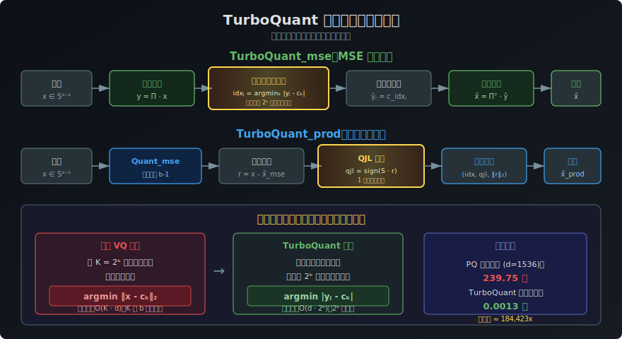
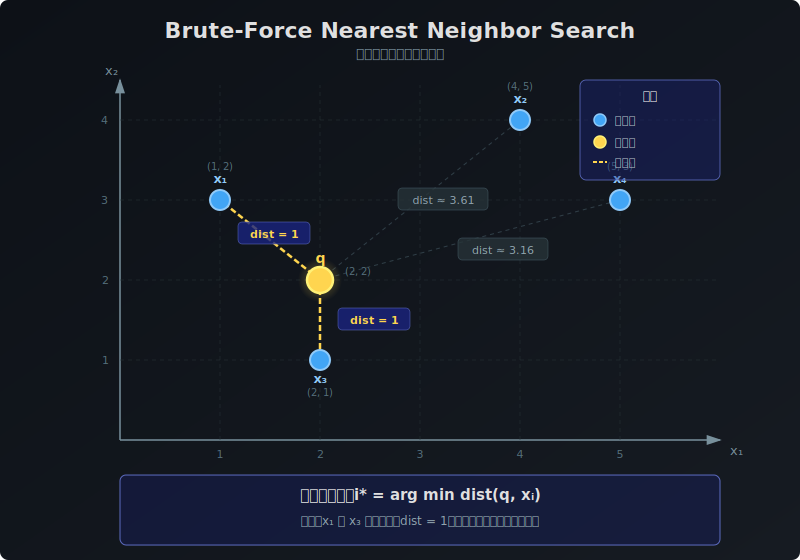

# 暴力法最近鄰搜尋 (Brute-Force Nearest Neighbor Search) 深度解析

[🏠 返回目錄](../index.md) | [返回主翻譯頁面](03-turboquant-translation.md)

**相關連結：**
- [返回 TurboQuant 論文翻譯](03-turboquant-translation.md)
- [最近鄰搜尋詳解](03-nearest-neighbor-explanation.md)
- [向量量化解釋](03-vector-quantization-explanation.md)
- [乘積量化解釋](03-product-quantization-explanation.md)
- [Lloyd-Max 量化器](03-lloyd-max-quantizer.md)

---

## 目錄

1. [什麼是暴力法最近鄰搜尋？](#1-什麼是暴力法最近鄰搜尋)
2. [數學定義與形式化](#2-數學定義與形式化)
3. [演算法詳解與實作](#3-演算法詳解與實作)
4. [計算複雜度分析](#4-計算複雜度分析)
5. [在向量量化中的核心角色](#5-在向量量化中的核心角色)
6. [與 TurboQuant 的深度關聯](#6-與-turboquant-的深度關聯)
7. [從暴力法到高效量化——TurboQuant 的突破](#7-從暴力法到高效量化turboquant-的突破)
8. [TurboQuant 最近鄰搜尋實驗解析](#8-turboquant-最近鄰搜尋實驗解析)
9. [暴力法的變體與優化](#9-暴力法的變體與優化)
10. [總結與關鍵洞見](#10-總結與關鍵洞見)

---

## 1. 什麼是暴力法最近鄰搜尋？

**暴力法最近鄰搜尋（Brute-Force Nearest Neighbor Search）**，也稱為「窮舉搜尋」或「線性掃描」，是在一個資料集中尋找與目標查詢向量距離最近的一個或多個向量的最直接方法。

其核心思想非常簡單：**計算目標向量與資料集中「每一個」樣本向量之間的距離，然後選出距離最小的那個。**

這種方法雖然概念上最為簡單，但在向量量化的歷史發展和 TurboQuant 的演算法設計中都扮演著關鍵角色。

### 1.1 直觀理解

想像你在一個陌生的城市中尋找離你最近的一家咖啡店。暴力法的做法就是：逐一計算你與城市中每一家咖啡店的距離，然後選擇最近的那家。這種方法保證能找到正確答案，但當咖啡店數量龐大時，計算量也會隨之線性增長。

---

## 2. 數學定義與形式化

### 2.1 基本定義

給定一個資料集 $X = \{x_1, x_2, \dots, x_N\} \subset \mathbb{R}^d$，以及一個查詢向量 $q \in \mathbb{R}^d$。

暴力法最近鄰搜尋的目標是找到索引 $i^*$，使得：

$$i^* = \arg\min_{i=1,\dots,N} \text{dist}(q, x_i)$$

其中 $\text{dist}(\cdot, \cdot)$ 是距離度量。

### 2.2 常見的距離度量

在不同的應用場景中，距離度量的選擇至關重要：

| 距離度量 | 公式 | 應用場景 | 與 TurboQuant 的關聯 |
|:---------|:-----|:---------|:---------------------|
| **歐幾里得距離 ($L_2$)** | $\|q - x_i\|_2 = \sqrt{\sum_{j=1}^d (q_j - x_{i,j})^2}$ | 幾何空間中的最近鄰 | MSE 最佳化目標 |
| **內積 (Inner Product)** | $\langle q, x_i \rangle = \sum_{j=1}^d q_j x_{i,j}$ | 相似度衡量（越大越相似） | 內積最佳化目標 |
| **餘弦相似度** | $\cos(\theta) = \frac{\langle q, x_i \rangle}{\|q\|_2 \cdot \|x_i\|_2}$ | 方向相似度 | 歸一化後等價於內積 |
| **曼哈頓距離 ($L_1$)** | $\|q - x_i\|_1 = \sum_{j=1}^d \|q_j - x_{i,j}\|$ | 稀疏特徵空間 | 較少使用 |

### 2.3 歐幾里得距離與內積的等價轉換

在 TurboQuant 的語境中，一個重要的數學事實是：**當向量被歸一化到單位球面上時（$\|x\|_2 = 1$），最小化歐幾里得距離等價於最大化內積**。

推導如下：

$$\|q - x_i\|_2^2 = \|q\|_2^2 + \|x_i\|_2^2 - 2\langle q, x_i \rangle$$

當 $\|q\|_2 = \|x_i\|_2 = 1$ 時：

$$\|q - x_i\|_2^2 = 2 - 2\langle q, x_i \rangle$$

因此：

$$\arg\min_{i} \|q - x_i\|_2 = \arg\max_{i} \langle q, x_i \rangle$$

這個等價關係解釋了為什麼 TurboQuant 同時關注 MSE 失真和內積失真——它們分別對應了最近鄰搜尋中的兩種基本度量。

### 2.4 k-最近鄰變體

暴力法也可以自然地推廣到 k-最近鄰搜尋（k-NN）：

$$\text{kNN}(q) = \arg\text{top-}k_{i=1,\dots,N} \text{dist}(q, x_i)$$

即找出距離最小的 $k$ 個資料點，而非僅僅一個。在 TurboQuant 的最近鄰搜尋實驗中（論文第 4.4 節），使用的評估指標 **Recall@k** 就是基於 k-NN 的結果。

---

## 3. 演算法詳解與實作

### 3.1 基本演算法

```
演算法：Brute-Force Nearest Neighbor Search

輸入：
  - 資料集 X = {x_1, x_2, ..., x_N}，每個 x_i ∈ ℝ^d
  - 查詢向量 q ∈ ℝ^d
  - 距離度量 dist(·, ·)

輸出：
  - 最近鄰索引 i* 和對應距離 d*

步驟：
1. d* ← +∞
2. i* ← null
3. for i = 1 to N do
4.     d_i ← dist(q, x_i)
5.     if d_i < d* then
6.         d* ← d_i
7.         i* ← i
8.     end if
9. end for
10. return (i*, d*)
```

### 3.2 Python 實作範例

```python
import numpy as np

def brute_force_nn(query, dataset, metric='euclidean'):
    """
    暴力法最近鄰搜尋
    
    參數:
        query: 查詢向量，形狀 (d,)
        dataset: 資料集，形狀 (N, d)
        metric: 距離度量，'euclidean' 或 'inner_product'
    
    返回:
        nearest_idx: 最近鄰的索引
        nearest_dist: 最近鄰的距離（或相似度）
    """
    if metric == 'euclidean':
        # 計算歐幾里得距離
        distances = np.sqrt(np.sum((dataset - query) ** 2, axis=1))
        nearest_idx = np.argmin(distances)
        
    elif metric == 'inner_product':
        # 計算內積（越大越相似）
        similarities = np.dot(dataset, query)
        nearest_idx = np.argmax(similarities)
        distances = similarities  # 此時返回的是相似度
    
    return nearest_idx, distances[nearest_idx]


def brute_force_knn(query, dataset, k=10, metric='euclidean'):
    """
    暴力法 k-最近鄰搜尋
    
    參數:
        query: 查詢向量，形狀 (d,)
        dataset: 資料集，形狀 (N, d)
        k: 要找的最近鄰數量
        metric: 距離度量
    
    返回:
        indices: k 個最近鄰的索引
        distances: 對應的距離
    """
    if metric == 'euclidean':
        distances = np.sqrt(np.sum((dataset - query) ** 2, axis=1))
        indices = np.argsort(distances)[:k]
        
    elif metric == 'inner_product':
        similarities = np.dot(dataset, query)
        indices = np.argsort(-similarities)[:k]  # 降序排列
        distances = similarities[indices]
    
    return indices, distances[indices]
```

### 3.3 實例說明

假設我們在一個二維平面上有 4 個點（資料集）和一個查詢點 $q$：

- $x_1 = (1, 2)$
- $x_2 = (4, 5)$
- $x_3 = (2, 1)$
- $x_4 = (5, 3)$
- $q = (2, 2)$

**歐幾里得距離搜尋步驟**：

| 步驟 | 計算 | 距離 |
|:----:|:-----|:----:|
| 1 | $\|q - x_1\|_2 = \sqrt{(2-1)^2 + (2-2)^2} = \sqrt{1+0}$ | $1$ |
| 2 | $\|q - x_2\|_2 = \sqrt{(2-4)^2 + (2-5)^2} = \sqrt{4+9}$ | $\sqrt{13} \approx 3.61$ |
| 3 | $\|q - x_3\|_2 = \sqrt{(2-2)^2 + (2-1)^2} = \sqrt{0+1}$ | $1$ |
| 4 | $\|q - x_4\|_2 = \sqrt{(2-5)^2 + (2-3)^2} = \sqrt{9+1}$ | $\sqrt{10} \approx 3.16$ |

**結果**：最小距離為 $1$，對應最近鄰為 $x_1$ 和 $x_3$（平手）。

**內積搜尋步驟**（假設所有向量已歸一化）：

| 步驟 | 計算 | 內積 |
|:----:|:-----|:----:|
| 1 | $\langle q, x_1 \rangle = 2 \times 1 + 2 \times 2 = 6$ | $6$ |
| 2 | $\langle q, x_2 \rangle = 2 \times 4 + 2 \times 5 = 18$ | $18$ |
| 3 | $\langle q, x_3 \rangle = 2 \times 2 + 2 \times 1 = 6$ | $6$ |
| 4 | $\langle q, x_4 \rangle = 2 \times 5 + 2 \times 3 = 16$ | $16$ |

**結果**：最大內積為 $18$，對應最近鄰為 $x_2$。

> ⚠️ **注意**：使用不同距離度量可能得到不同的最近鄰結果！這正是 TurboQuant 需要同時考慮 MSE 和內積失真的原因。

---

## 4. 計算複雜度分析

### 4.1 時間複雜度

| 操作 | 時間複雜度 | 說明 |
|:----:|:----------:|:-----|
| 單次查詢 | $O(N \cdot d)$ | 需與所有 $N$ 個點計算距離 |
| 批量查詢（$Q$ 個） | $O(Q \cdot N \cdot d)$ | 每個查詢獨立計算 |
| 建立索引 | $O(1)$ | 無需預處理 |
| 記憶體 | $O(N \cdot d)$ | 儲存所有資料點 |

### 4.2 為什麼暴力法在大規模場景下不可行？

考慮一個典型的向量資料庫場景：

| 參數 | 值 | 說明 |
|:----:|:--:|:-----|
| $N$ | $10^9$ | 十億個向量 |
| $d$ | $1536$ | OpenAI 嵌入維度 |
| 單次查詢 | $1.536 \times 10^{12}$ | 浮點運算次數 |
| 查詢延遲 | 數秒至數十秒 | 無法滿足即時需求 |

這正是 TurboQuant 論文第 1.2 節所指出的問題：

> "最直接的編碼方法——暴力最近鄰搜尋——計算成本高昂，阻礙了 VQ 在實踐中的採用。"

---

## 5. 在向量量化中的核心角色

### 5.1 VQ 編碼就是最近鄰搜尋

向量量化（[Vector Quantization](03-vector-quantization-explanation.md)）的核心操作——**編碼（Encoding）**——本質上就是一個最近鄰搜尋問題。

給定一個碼本（Codebook）$\mathcal{C} = \{c_1, c_2, \dots, c_K\} \subset \mathbb{R}^d$，向量 $\mathbf{x}$ 的量化過程為：

$$Q(\mathbf{x}) = \arg\min_{c_i \in \mathcal{C}} \|\mathbf{x} - c_i\|_2^2$$

這就是一個在碼本上的最近鄰搜尋問題！碼本大小 $K = 2^b$（其中 $b$ 是位元寬度），因此：

| 位元寬度 $b$ | 碼本大小 $K = 2^b$ | 搜尋複雜度 |
|:------------:|:------------------:|:----------:|
| 1 | 2 | $O(d)$ |
| 2 | 4 | $O(4d)$ |
| 4 | 16 | $O(16d)$ |
| 8 | 256 | $O(256d)$ |

### 5.2 TurboQuant 中的最近鄰搜尋

在 [TurboQuant](03-turboquant-translation.md) 的演算法中，最近鄰搜尋出現在關鍵的量化步驟。回顧 **演算法 1**（$\text{TurboQuant}_{\text{mse}}$）的第 6 行：

$$\text{idx}_j \leftarrow \arg\min_{k \in [2^b]} |\mathbf{y}_j - c_k| \quad \text{對於每個 } j \in [d]$$

這就是一個**在碼本上的暴力最近鄰搜尋**！對於每個座標 $j$，我們需要在 $2^b$ 個質心中找到最接近 $\mathbf{y}_j$ 的那個。

**關鍵觀察**：由於 TurboQuant 使用純量量化（每個座標獨立量化），碼本大小 $2^b$ 通常很小（$b = 1, 2, 3, 4$），因此這個暴力搜尋的計算成本極低，且可以高度向量化。

### 5.3 與乘積量化中的最近鄰搜尋對比

在 [乘積量化（PQ）](03-product-quantization-explanation.md) 中，最近鄰搜尋的場景更為複雜：

| 特性 | TurboQuant | 乘積量化 (PQ) |
|:----:|:----------:|:------------:|
| **碼本搜尋範圍** | 每座標 $2^b$ 個質心 | 每子空間 $2^b$ 個質心 |
| **搜尋次數** | $d$ 次（每座標一次） | $m$ 次（每子空間一次） |
| **每次搜尋複雜度** | $O(2^b)$ | $O(2^b \cdot d/m)$ |
| **總搜尋複雜度** | $O(d \cdot 2^b)$ | $O(m \cdot 2^b \cdot d/m) = O(d \cdot 2^b)$ |
| **碼本建立** | 預計算（[Lloyd-Max](03-lloyd-max-quantizer.md)） | 需 k-means 訓練 |
| **加速器友好度** | 高（可向量化） | 低（查表操作） |

---

## 6. 與 TurboQuant 的深度關聯

### 6.1 歷史脈絡：暴力法阻礙了 VQ 的早期發展

TurboQuant 論文在第 1.2 節「VQ 的開端」中明確指出：

> "儘管有這些理論進步，向量量化的實際適用性在早期仍不清楚。最直接的編碼方法——[暴力最近鄰搜尋](03-brute-force-nn-explanation.md)——計算成本高昂，阻礙了 VQ 在實踐中的採用。"

這句話揭示了向量量化發展史中的一個核心矛盾：

| 理論 | 實踐 |
|:----:|:----:|
| Shannon 的信源編碼理論證明了 VQ 的最佳性 | 暴力法編碼的計算成本使 VQ 難以實用 |
| Zador 推導了極限操作失真-率函數 | 缺乏高效的編碼演算法 |
| Gersho 推廣了高解析度理論和晶格 VQ | 需要可行的實作方案 |

### 6.2 TurboQuant 如何化解暴力法的困境

TurboQuant 透過以下創新巧妙地化解了暴力法帶來的計算瓶頸：

#### 創新 1：隨機旋轉 + 純量量化 = 無需暴力搜尋高維碼本

傳統 VQ 需要在高維空間中搜尋最近鄰碼字，這是一個 $O(K \cdot d)$ 的操作（$K$ 是碼本大小）。TurboQuant 的關鍵洞見是：

1. **隨機旋轉**：對輸入向量 $\mathbf{x}$ 應用隨機旋轉矩陣 $\mathbf{\Pi}$，得到 $\mathbf{y} = \mathbf{\Pi} \cdot \mathbf{x}$
2. **座標獨立**：旋轉後的每個座標 $\mathbf{y}_j$ 近似獨立，服從 [Beta 分佈](03-beta-distribution.md)
3. **純量量化**：對每個座標獨立進行量化，只需在 $2^b$ 個質心中搜尋

$$\text{idx}_j = \arg\min_{k \in [2^b]} |\mathbf{y}_j - c_k|$$

這將原本 $O(K \cdot d)$ 的高維搜尋問題，轉化為 $d$ 個獨立的 $O(2^b)$ 純量搜尋問題！

#### 創新 2：預計算碼本消除線上搜尋開銷

由於 Beta 分佈的參數僅取決於維度 $d$ 和位元寬度 $b$（與輸入數據無關），TurboQuant 可以**預先計算**最佳碼本：

$$\mathcal{C}(f_X, b) := \min_{-1 \leq c_1 \leq c_2 \leq \ldots \leq c_{2^b} \leq 1} \sum_{i=1}^{2^b} \int_{\frac{c_{i-1}+c_i}{2}}^{\frac{c_i+c_{i+1}}{2}} |x - c_i|^2 \cdot f_X(x) dx$$

這個預計算意味著：
- **線上階段**：只需查表，無需任何最佳化
- **索引時間**：幾乎為零（論文表 2 顯示 TurboQuant 的量化時間比 PQ 快數十萬倍）

#### 創新 3：向量化實作

由於每個座標的搜尋是獨立的，且碼本大小 $2^b$ 很小，整個量化過程可以高度向量化：

```python
# TurboQuant 量化的核心步驟（偽代碼）
y = Pi @ x                          # 隨機旋轉（矩陣乘法，可 GPU 加速）
idx = argmin(abs(y[:, None] - c[None, :]), axis=1)  # 每座標最近鄰搜尋（可向量化）
```

### 6.3 TurboQuant 演算法中的最近鄰搜尋步驟詳解

讓我們仔細分析 [TurboQuant 演算法](03-turboquant-translation.md) 中每一步的最近鄰搜尋：

#### $\text{TurboQuant}_{\text{mse}}$（演算法 1）

| 步驟 | 操作 | 最近鄰搜尋？ | 說明 |
|:----:|:----:|:----------:|:-----|
| 2 | 生成隨機旋轉矩陣 $\mathbf{\Pi}$ | ❌ | 一次性操作 |
| 3 | 構建碼本 $c_1, \ldots, c_{2^b}$ | ❌ | 預計算，使用 [Lloyd-Max](03-lloyd-max-quantizer.md) |
| 5 | $\mathbf{y} \leftarrow \mathbf{\Pi} \cdot \mathbf{x}$ | ❌ | 矩陣乘法 |
| **6** | $\text{idx}_j \leftarrow \arg\min_{k} |\mathbf{y}_j - c_k|$ | **✅** | **純量最近鄰搜尋** |
| 9 | $\tilde{\mathbf{y}}_j \leftarrow c_{\text{idx}_j}$ | ❌ | 查表 |
| 10 | $\tilde{\mathbf{x}} \leftarrow \mathbf{\Pi}^\top \cdot \tilde{\mathbf{y}}$ | ❌ | 矩陣乘法 |

#### $\text{TurboQuant}_{\text{prod}}$（演算法 2）

| 步驟 | 操作 | 最近鄰搜尋？ | 說明 |
|:----:|:----:|:----------:|:-----|
| 5 | $\text{idx} \leftarrow \text{Quant}_{\text{mse}}(\mathbf{x})$ | **✅** | 呼叫演算法 1 的步驟 6 |
| 6 | $\mathbf{r} \leftarrow \mathbf{x} - \text{DeQuant}_{\text{mse}}(\text{idx})$ | ❌ | 計算殘差 |
| 7 | $\text{qjl} \leftarrow \text{sign}(\mathbf{S} \cdot \mathbf{r})$ | ❌ | QJL 符號運算 |

**關鍵洞見**：TurboQuant 將高維向量量化中的最近鄰搜尋問題，簡化為 $d$ 個獨立的低維度純量最近鄰搜尋，每個只需在 $2^b$ 個質心中搜尋。這是 TurboQuant 能夠實現「索引時間幾乎為零」的根本原因。



*(註：上圖展示了 TurboQuant_mse 和 TurboQuant_prod 兩個演算法中最近鄰搜尋步驟的位置，以及從高維碼本搜尋到純量查表的關鍵轉換。黃色高亮區域為暴力最近鄰搜尋步驟。)*

---

## 7. 從暴力法到高效量化——TurboQuant 的突破

### 7.1 暴力法在 VQ 中的計算瓶頸

在傳統向量量化中，暴力法編碼的計算成本是：

$$\text{編碼成本} = O(N_{\text{codebook}} \cdot d)$$

其中 $N_{\text{codebook}}$ 是碼本大小，$d$ 是向量維度。

對於高位元寬度，碼本大小呈指數增長：

| 每維度位元 $b$ | 碼本大小 $2^b$ | 維度 $d$ | 編碼成本 |
|:--------------:|:--------------:|:--------:|:--------:|
| 1 | 2 | 1536 | $3{,}072$ |
| 2 | 4 | 1536 | $6{,}144$ |
| 4 | 16 | 1536 | $24{,}576$ |
| 8 | 256 | 1536 | $393{,}216$ |

### 7.2 TurboQuant 的降維打擊策略

TurboQuant 透過隨機旋轉將高維 VQ 問題分解為 $d$ 個獨立的純量量化問題：

| 方法 | 搜尋空間 | 搜尋次數 | 每次搜尋成本 | 總成本 |
|:----:|:--------:|:--------:|:----------:|:------:|
| 傳統 VQ | $\mathbb{R}^d$ 中的 $K$ 個碼字 | 1 | $O(K \cdot d)$ | $O(K \cdot d)$ |
| PQ | $m$ 個子空間，每個 $K$ 個碼字 | $m$ | $O(K \cdot d/m)$ | $O(K \cdot d)$ |
| **TurboQuant** | $d$ 個純量，每個 $2^b$ 個質心 | $d$ | $O(2^b)$ | $O(d \cdot 2^b)$ |

由於 $2^b$ 通常很小（$b = 1, 2, 3, 4$），TurboQuant 的每次純量搜尋幾乎是常數時間操作！


*(註：上圖對比了傳統 VQ 暴力法、乘積量化 (PQ) 和 TurboQuant 三種方法的編碼流程和複雜度差異。)*

### 7.3 索引時間對比

論文表 2 的實驗結果清楚地展示了這一優勢：

| 方法 | $d=200$ | $d=1536$ | $d=3072$ |
|:----:|:-------:|:--------:|:--------:|
| Product Quantization | 37.04 秒 | 239.75 秒 | 494.42 秒 |
| RabitQ | 597.25 秒 | 2267.59 秒 | 3957.19 秒 |
| **TurboQuant** | **0.0007 秒** | **0.0013 秒** | **0.0021 秒** |

TurboQuant 的索引時間比 PQ 快了約 **5 萬到 18 萬倍**！這正是因為 TurboQuant 將暴力最近鄰搜尋從高維碼本搜尋簡化為了極低成本的純量查表操作。

---

## 8. TurboQuant 最近鄰搜尋實驗解析

### 8.1 實驗設置

論文第 4.4 節專門評估了 TurboQuant 在最近鄰搜尋任務中的表現：

- **數據集**：DBpedia Entities（OpenAI3 嵌入，1536 維和 3072 維）、GloVe（200 維）
- **訓練集**：100,000 個數據點
- **查詢集**：1,000 個查詢點
- **評估指標**：Recall@k（記為 1@k），衡量真實 top-1 內積結果是否出現在近似 top-k 結果中
- **對比方法**：Product Quantization (PQ)、RabitQ

### 8.2 TurboQuant 在最近鄰搜尋中的工作流程

```
TurboQuant 最近鄰搜尋流程：

1. 索引階段（Indexing Phase）：
   ┌─────────────────────────────────────────────────────────┐
   │  對每個資料庫向量 x_i：                                    │
   │    a. 歸一化：x_i ← x_i / ‖x_i‖                         │
   │    b. 量化：idx_i ← Quant_prod(x_i)                      │
   │    c. 儲存：(idx_i, qjl_i, γ_i)                          │
   │                                                          │
   │  ★ 索引時間 ≈ 0（無需 k-means 訓練！）                    │
   └─────────────────────────────────────────────────────────┘

2. 查詢階段（Query Phase）：
   ┌─────────────────────────────────────────────────────────┐
   │  對查詢向量 q：                                           │
   │    a. 歸一化：q ← q / ‖q‖                                │
   │    b. 對每個量化後的資料庫向量，計算近似內積：                │
   │       ĝ(q, x_i) ≈ ⟨q, DeQuant_prod(idx_i, qjl_i, γ_i)⟩ │
   │    c. 返回 top-k 近似最近鄰                                │
   └─────────────────────────────────────────────────────────┘
```

### 8.3 為什麼 TurboQuant 的無偏內積估計至關重要？

在最近鄰搜尋中，我們需要準確估計查詢向量與資料庫向量之間的內積。如果量化器是有偏的，那麼：

- **有偏估計**：$\mathbb{E}[\langle \mathbf{y}, \tilde{\mathbf{x}} \rangle] \neq \langle \mathbf{y}, \mathbf{x} \rangle$
  - 導致系統性的排序錯誤
  - 某些向量的內積被系統性地高估或低估
  - 召回率下降

- **無偏估計**（$\text{TurboQuant}_{\text{prod}}$）：$\mathbb{E}[\langle \mathbf{y}, \tilde{\mathbf{x}} \rangle] = \langle \mathbf{y}, \mathbf{x} \rangle$
  - 內積估計的期望值等於真實值
  - 排序正確的機率更高
  - 召回率更高

這就是為什麼 TurboQuant 設計了專門的 $\text{TurboQuant}_{\text{prod}}$ 變體來保證內積估計的無偏性。

### 8.4 實驗結果解讀

論文圖 5 展示了在不同數據集和維度下的 Recall@k 結果：

1. **TurboQuant 在所有設置中都優於 PQ 和 RabitQ**
2. **優勢在低位元寬度時尤為顯著**——這與 TurboQuant 的理論保證一致
3. **即使 PQ 使用相同數據集進行訓練（不公平優勢），TurboQuant 仍然勝出**

這些結果驗證了 TurboQuant 的核心洞見：**透過隨機旋轉和最佳純量量化，可以避免傳統 VQ 中的暴力碼本搜尋，同時達到更好的失真率。**

---

## 9. 暴力法的變體與優化

### 9.1 批次處理優化

在實際應用中，暴力法可以透過矩陣運算進行批次處理：

```python
# 批次暴力法最近鄰搜尋
def batch_brute_force_nn(queries, dataset, metric='euclidean'):
    """
    批次處理多個查詢
    
    參數:
        queries: 查詢矩陣，形狀 (Q, d)
        dataset: 資料集矩陣，形狀 (N, d)
    
    返回:
        indices: 每個查詢的最近鄰索引，形狀 (Q,)
    """
    if metric == 'euclidean':
        # 利用 ‖q - x‖² = ‖q‖² + ‖x‖² - 2⟨q, x⟩
        q_norms = np.sum(queries ** 2, axis=1, keepdims=True)  # (Q, 1)
        x_norms = np.sum(dataset ** 2, axis=1, keepdims=True).T  # (1, N)
        dists = q_norms + x_norms - 2 * queries @ dataset.T  # (Q, N)
        return np.argmin(dists, axis=1)
    
    elif metric == 'inner_product':
        similarities = queries @ dataset.T  # (Q, N)
        return np.argmax(similarities, axis=1)
```

這種批次處理可以充分利用 GPU 的平行計算能力，是 TurboQuant 能夠高效運行的基礎。

### 9.2 早期終止策略

在實踐中，可以加入一些優化來加速暴力搜尋：

1. **部分距離計算**：如果在計算某個維度的距離時，累積距離已超過當前最小距離，可以提前終止該向量的計算
2. **排序優化**：根據先前查詢的統計資訊，調整搜尋順序
3. **SIMD/向量化**：利用 CPU/GPU 的向量化指令同時計算多個距離

### 9.3 與近似最近鄰搜尋（ANN）的對比

| 方法 | 精確度 | 速度 | 記憶體 | 預處理 | TurboQuant 中的角色 |
|:----:|:-----:|:----:|:------:|:------:|:-------------------:|
| 暴力法 | 100% | 慢 | $O(Nd)$ | 無 | 碼本搜尋（小規模） |
| kd-tree | 100% | 快（低維） | $O(Nd)$ | $O(Nd\log N)$ | 不適用 |
| HNSW | 高 | 快 | $O(Nd)$ | $O(Nd\log N)$ | 不適用 |
| LSH | 近似 | 中等 | $O(Nd)$ | 中等 | 不適用 |
| PQ + 倒排 | 近似 | 快 | $O(Nd/m)$ | $O(Nd)$ | 資料庫搜尋（對比基線） |
| **TurboQuant** | **高** | **極快** | $O(Nb)$ | **≈ 0** | **量化 + 搜尋** |

---

## 10. 總結與關鍵洞見

### 10.1 核心概念回顧

| 概念 | 說明 |
|:-----|:-----|
| **暴力法最近鄰搜尋** | 逐一計算查詢向量與所有資料點的距離，保證找到精確最近鄰 |
| **計算複雜度** | $O(N \cdot d)$，隨數據量線性增長 |
| **在 VQ 中的角色** | 量化編碼步驟本質上是碼本上的最近鄰搜尋 |
| **歷史影響** | 暴力法的高計算成本曾阻礙 VQ 的實際應用 |

### 10.2 TurboQuant 的突破性洞見

1. **降維打擊**：透過隨機旋轉，將高維 VQ 的碼本搜尋問題分解為 $d$ 個獨立的純量最近鄰搜尋
2. **預計算碼本**：利用 Beta 分佈的確定性質，預先計算最佳碼本，消除線上搜尋開銷
3. **無偏內積**：$\text{TurboQuant}_{\text{prod}}$ 保證內積估計的無偏性，確保最近鄰搜尋的排序正確性
4. **索引時間 ≈ 0**：相比 PQ 需要數百秒的 k-means 訓練，TurboQuant 幾乎不需要預處理

### 10.3 從暴力法到 TurboQuant 的演進

```
傳統 VQ 編碼（暴力法）：
  輸入 x → 在高維碼本中暴力搜尋最近鄰 → 輸出索引
  問題：O(K·d)，K 隨位元寬度指數增長

PQ 編碼（分治法）：
  輸入 x → 切分為 m 個子向量 → 每個子向量在子碼本中搜尋 → 輸出 m 個索引
  問題：需要 k-means 訓練，索引時間長

TurboQuant 編碼（隨機旋轉 + 純量量化）：
  輸入 x → 隨機旋轉 Π·x → 每座標在預計算碼本中查表 → 輸出 d 個索引
  優勢：O(d·2^b)，2^b 很小，且可向量化
```

### 10.4 關鍵公式速查

| 公式 | 說明 |
|:-----|:-----|
| $i^* = \arg\min_{i} \text{dist}(q, x_i)$ | 暴力法最近鄰搜尋定義 |
| $\text{idx}_j = \arg\min_{k \in [2^b]} \|\mathbf{y}_j - c_k\|$ | TurboQuant 中的純量最近鄰搜尋 |
| $\|q - x_i\|_2^2 = 2 - 2\langle q, x_i \rangle$（當 $\|q\|=\|x_i\|=1$） | 歐幾里得距離與內積的等價關係 |
| $D_{\text{mse}} \leq \frac{3\pi}{2} \cdot \frac{1}{4^b}$ | TurboQuant MSE 失真上界 |
| $D_{\text{prod}} \leq \frac{3\pi}{2} \cdot \frac{\|\mathbf{y}\|_2^2}{d} \cdot \frac{1}{4^b}$ | TurboQuant 內積失真上界 |

---

## 圖解說明



*(註：上圖展示了目標點 $q$ 與資料點之間的距離計算，以及如何比較得出最近的鄰居。)*

---

## 參考文獻

1. [TurboQuant 論文翻譯](03-turboquant-translation.md) - 第 1.2 節討論了暴力法在 VQ 歷史中的角色，第 4.4 節討論了最近鄰搜尋實驗
2. [最近鄰搜尋詳解](03-nearest-neighbor-explanation.md) - 最近鄰搜尋的完整技術概述
3. [向量量化解釋](03-vector-quantization-explanation.md) - VQ 的基礎概念
4. [乘積量化解釋](03-product-quantization-explanation.md) - PQ 方法及其與 TurboQuant 的對比
5. [Lloyd-Max 量化器](03-lloyd-max-quantizer.md) - TurboQuant 使用的最佳純量量化器
6. [K-Means 問題](03-k-means-problem.md) - 連續 K-Means 與碼本最佳化
6. [Beta 分佈](03-beta-distribution.md) - TurboQuant 隨機旋轉後座標的分佈
7. [內積失真](03-inner-product-distortion.md) - 內積估計的失真度量
8. [內積誤差](03-inner-product-errors.md) - 內積誤差的詳細分析

---

*最後更新：2026-05-15*
*作者：TurboQuant Deep Dive Project*
