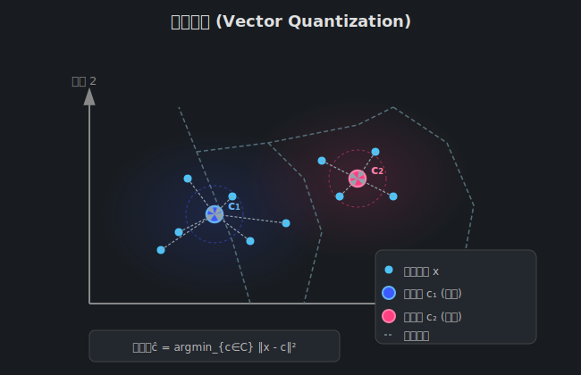
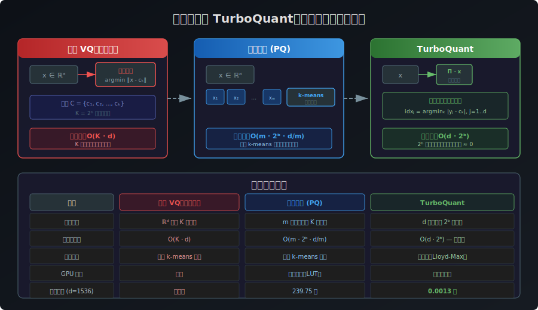

# Gersho 的開創性論文：向量量化的理論基石

[🏠 返回目錄](../index.md) | [返回 TurboQuant 翻譯主頁](03-turboquant-translation.md)

---

## 目錄

1. [概述](#概述)
2. [Gersho 的兩篇里程碑論文](#gersho-的兩篇里程碑論文)
3. [高分辨率理論與 Zador 結果的簡化](#高分辨率理論與-zador-結果的簡化)
4. [Gersho 猜想：塑造 VQ 領域的關鍵假說](#gersho-猜想塑造-vq-領域的關鍵假說)
5. [晶格向量量化（Lattice Vector Quantization）](#晶格向量量化lattice-vector-quantization)
6. [向量量化器的結構：Voronoi 鑲嵌](#向量量化器的結構voronoi-鑲嵌)
7. [從 Gersho 到 TurboQuant：理論傳承與創新](#從-gersho-到-turboquant理論傳承與創新)
8. [視覺化說明](#視覺化說明)
9. [總結](#總結)
10. [參考文獻](#參考文獻)

---

## 概述

Allen Gersho 在[向量量化（Vector Quantization, VQ）](03-vector-quantization-explanation.md)領域具有奠基性的貢獻。TurboQuant 論文在「相關工作」章節中明確指出：

> *Gersho's influential paper [25], further advanced the vector quantization by **popularizing high-resolution theory**, **simplifying Zador's results**, **introducing lattice vector quantization**, and **proposing a key conjecture that shaped the field**.*

這段簡短的描述背後，蘊含了向量量化理論從抽象數學走向實際應用的關鍵轉折。Gersho 的貢獻不僅是理論上的推進，更是將 VQ 從純學術研究轉化為工程實踐的橋樑。本章將逐一拆解 Gersho 的四大貢獻，並深入探討它們如何影響了 TurboQuant 的設計哲學。

### 歷史定位

| 時期 | 關鍵人物 | 貢獻 | 與 Gersho 的關係 |
|------|----------|------|-----------------|
| 1948–1959 | Shannon | 建立信源編碼理論與失真 - 率函數 | Gersho 的理論基礎 |
| 1963 | Zador | 推導高分辨率下的極限操作失真 - 率函數 | Gersho 簡化了 Zador 的結果 |
| **1979** | **Gersho** | **提出漸近最佳區塊量化理論** | **本篇重點** |
| **1982** | **Gersho** | **提出向量量化器結構理論與 Gersho 猜想** | **本篇重點** |
| 1992 | Gersho & Gray | 出版經典教材 *Vector Quantization and Signal Compression* | 集大成之作 |
| 2025 | Zandieh et al. | 提出 TurboQuant | 繼承並創新 Gersho 的理論遺產 |

---

## Gersho 的兩篇里程碑論文

Gersho 在向量量化領域的影響力主要來自兩篇開創性論文，TurboQuant 論文的參考文獻 [25] 和 [26] 分別引用了這兩篇：

### 論文一：Asymptotically Optimal Block Quantization（1979）

- **發表期刊**：IEEE Transactions on Information Theory, 25(4):373–380
- **核心貢獻**：
  1. **普及高分辨率理論**：將 Zador 的高分辨率量化理論以更直觀、更易理解的方式重新推導和呈現
  2. **簡化 Zador 結果**：Zador 1963 年的原始結果數學上極為複雜，Gersho 提供了更簡潔的表達形式
  3. **引入晶格向量量化**：首次系統性地提出利用晶格結構來構建向量量化器
  4. **提出 Gersho 猜想**：一個關於高維量化器最佳性能的深刻假說

### 論文二：On the Structure of Vector Quantizers（1982）

- **發表期刊**：IEEE Transactions on Information Theory, 28(2):157–166
- **核心貢獻**：
  1. 系統性分析向量量化器的幾何結構
  2. 建立了向量量化器的 [Voronoi 鑲嵌](#向量量化器的結構voronoi-鑲嵌)理論框架
  3. 深化對量化器最佳結構的理解

---

## 高分辨率理論與 Zador 結果的簡化

### 什麼是高分辨率理論？

**高分辨率理論（High-Resolution Theory）** 是量化理論的一個分支，研究的是當量化器使用**大量量化層級**（即高位元率）時的漸近行為。在高位元率條件下，量化區間變得非常小，使得數學分析可以大幅簡化。

> 💡 **直觀理解**：想像將一條線段切成越來越多的等份——當份數足夠多時，每一小段內的曲線可以近似為直線，這就是高分辨率近似的本質。

### Zador 的原始結果（1963）

Peter Zador 在其 1963 年的博士論文中，利用高分辨率方法推導了**固定碼率量化在高碼率下的極限操作失真 - 率函數**。TurboQuant 論文指出：

> *In 1963, Zador [61] made significant advances by employing high-resolution methods to derive the limiting operational distortion-rate function for fixed-rate quantization at high rates that closely matches Shannon's distortion-rate function.*

Zador 的結果表明，對於 $k$ 維向量量化器，當碼率 $R$ 趨於無窮大時，MSE 失真滿足：

$$D(R) \approx C(k) \cdot \sigma^2 \cdot 2^{-2R}$$

其中 $C(k)$ 是一個與維度 $k$ 和信源分佈相關的常數，$\sigma^2$ 是信源方差。這個結果與 [Shannon 的失真 - 率函數](03-shannon-source-coding-theory.md) $D(R) = \sigma^2 \cdot 2^{-2R}$ 非常接近，差異僅在常數因子 $C(k)$。

然而，Zador 的原始推導極為複雜，且**沒有考慮可實現的演算法**，這使得其結果難以被工程師理解和應用。

### Gersho 的簡化與普及

Gersho 在 1979 年的論文中，以更清晰、更系統的方式重新推導了高分辨率理論的核心結果。他的關鍵簡化包括：

#### 1. 純量量化的 Panter-Dite 公式

Gersho 首先回顧了純量量化（1 維）的高分辨率失真公式，即 **Panter-Dite 公式**（1949）：

$$D_{\text{scalar}} = \frac{1}{12} \cdot \left(\int f_X(x)^{1/3} dx\right)^3 \cdot 2^{-2R}$$

其中 $f_X(x)$ 是信源的機率密度函數。這個公式在 TurboQuant 的定理 1 證明中被直接使用——論文利用 Panter-Dite 公式為較大位元寬度 $b > 4$ 的情況建立了失真上界：

$$\mathcal{C}(f_X, b) \leq \frac{1}{12} \cdot \left(\int f_X(x)^{1/3} dx\right)^3 \cdot \frac{1}{4^b} = \frac{3\pi}{2d} \cdot \frac{1}{4^b}$$

#### 2. 向量量化的高分辨率推廣

Gersho 將 Panter-Dite 公式推廣到 $k$ 維向量量化，得到：

$$D_{\text{vector}}(R) \approx G(k) \cdot \left(\int_{\mathbb{R}^k} f(\mathbf{x})^{k/(k+2)} d\mathbf{x}\right)^{(k+2)/k} \cdot 2^{-2R}$$

其中 $G(k)$ 是一個僅依賴於維度 $k$ 的常數，稱為**量化常數**。這個常數反映了 $k$ 維空間中最佳量化區域的形狀效率。

#### 3. 與 Shannon 下界的比較

| 理論 | 失真公式 | 常數因子 |
|------|----------|----------|
| Shannon 下界 | $D(R) = \sigma^2 \cdot 2^{-2R}$ | 常數 = 1（理論極限） |
| Zador 結果 | $D(R) \approx C(k) \cdot \sigma^2 \cdot 2^{-2R}$ | $C(k) \geq 1$ |
| Gersho 簡化 | $D(R) \approx G(k) \cdot (\text{分佈項}) \cdot 2^{-2R}$ | $G(k)$ 依賴維度 |

Gersho 的簡化使得研究者可以更直觀地理解：**向量量化的失真 - 率性能與 Shannon 下界之間的差距，完全由量化常數 $G(k)$ 決定**。這為後續研究（包括 TurboQuant）提供了清晰的理論框架。

---

## Gersho 猜想：塑造 VQ 領域的關鍵假說

### 猜想的內容

**Gersho 猜想（Gersho Conjecture）** 是 Gersho 在 1979 年論文中提出的一個深刻假說，它斷言：

> **在足夠高的維度 $k$ 下，最佳向量量化器的 Voronoi 區域在形狀上漸近趨近於某種最佳晶格的 Voronoi 區域。**

更具體地，Gersho 猜想認為，對於均勻分佈信源，最佳 $k$ 維向量量化器的量化常數 $G(k)$ 滿足：

$$G(k) \to G^* \quad \text{as } k \to \infty$$

其中 $G^*$ 是某個最佳晶格的量化常數。

### 猜想的深遠影響

Gersho 猜想之所以「塑造了該領域」，是因為它：

1. **統一了理論框架**：將向量量化的最佳性問題轉化為晶格幾何問題
2. **指引了演算法設計**：如果最佳量化器的結構接近晶格，那麼基於晶格設計的量化器就具有理論上的正當性
3. **激發了大量研究**：數十年來，研究者們試圖證明或反駁這個猜想，推動了 VQ 理論的發展
4. **連接到 TurboQuant**：TurboQuant 的隨機旋轉策略本質上利用了高維空間中座標近似獨立的性質，這與 Gersho 猜想所暗示的高維漸近行為有深層聯繫

### 猜想的驗證狀態

| 維度 $k$ | 已知最佳 $G(k)$ | 對應晶格 | 猜想成立？ |
|----------|----------------|----------|-----------|
| 1 | $\frac{1}{12} \approx 0.0833$ | 均勻分割 | ✅ 已證明 |
| 2 | $\frac{5\sqrt{3}}{108} \approx 0.0802$ | 六角形晶格（$A_2$） | ✅ 已證明 |
| 3 | $\approx 0.0787$ | 體心立方晶格（$A_3^*$） | ✅ 已證明 |
| $\geq 4$ | 未精確知 | 未知 | ❓ 仍未完全解決 |

> ⚠️ **重要提醒**：Gersho 猜想在一般維度下至今仍未被嚴格證明，但它被廣泛認為是正確的，且已成為 VQ 理論的指導原則。

### 與 TurboQuant 的理論連結

TurboQuant 的核心洞察——**隨機旋轉使座標近似獨立，從而使逐座標純量量化接近向量量化的最佳性能**——可以從 Gersho 猜想的角度理解：

- Gersho 猜想暗示：在高維度下，最佳量化器的結構具有某種「規則性」
- TurboQuant 的隨機旋轉策略利用了高維空間的**測度集中現象**，使得任何座標的分佈趨於相同的 Beta 分佈
- 這種「各座標同分佈且近似獨立」的性質，使得**逐座標最佳純量量化**（即 [Lloyd-Max 量化器](03-lloyd-max-quantizer.md)）就能接近整體最佳

---

## 晶格向量量化（Lattice Vector Quantization）

### 什麼是晶格？

**晶格（Lattice）** 是 $\mathbb{R}^k$ 中一個離散的、具有規則週期性結構的點集。形式上，給定 $k$ 個線性無關的向量 $\mathbf{a}_1, \mathbf{a}_2, \ldots, \mathbf{a}_k \in \mathbb{R}^k$，晶格定義為：

$$\Lambda = \{n_1 \mathbf{a}_1 + n_2 \mathbf{a}_2 + \cdots + n_k \mathbf{a}_k : n_i \in \mathbb{Z}\}$$

### Gersho 引入晶格向量量化的動機

在 Gersho 之前，向量量化的碼本通常需要透過 k-means 等數據驅動方法來學習，這帶來了兩個問題：

1. **計算成本高昂**：k-means 需要反覆迭代，且容易陷入局部最優
2. **缺乏理論保證**：學習到的碼本沒有系統性的理論分析框架

Gersho 提出：**為什麼不直接使用具有已知良好性質的晶格點作為碼本？**

### 晶格向量量化的優勢

| 特性 | 傳統 VQ（k-means 碼本） | 晶格 VQ |
|------|------------------------|---------|
| **碼本生成** | 需要訓練數據和迭代 | 數學定義，無需訓練 |
| **理論分析** | 困難，缺乏閉合解 | 有豐富的晶格幾何理論支撐 |
| **最近鄰搜尋** | 暴力搜尋或樹結構 | 可利用晶格的代數結構加速 |
| **失真界限** | 依賴數據分佈 | 可由晶格的量化常數精確計算 |
| **儲存需求** | 需要儲存整個碼本 | 僅需儲存晶格的生成矩陣 |

### 常見的晶格及其量化常數

| 晶格名稱 | 維度 $k$ | 量化常數 $G(k)$ | 應用場景 |
|----------|----------|----------------|----------|
| $\mathbb{Z}^k$（整數晶格） | 任意 $k$ | $\frac{1}{12}$ | 最簡單的均勻量化 |
| $A_2$（六角晶格） | 2 | $\frac{5\sqrt{3}}{108} \approx 0.0802$ | 2D 圖像編碼 |
| $A_3^*$（體心立方） | 3 | $\approx 0.0787$ | 3D 圖形處理 |
| $D_4$（Schläfli 晶格） | 4 | $\approx 0.0766$ | 4D 量化 |
| $E_8$（Gosset 晶格） | 8 | $\approx 0.0717$ | 高維量化，密度最佳 |
| Leech 晶格 $\Lambda_{24}$ | 24 | $\approx 0.0658$ | 24 維最佳已知 |

### 晶格 VQ 與 TurboQuant 的對比

TurboQuant 並未直接使用晶格向量量化，但兩者有深刻的理論聯繫：

| 面向 | 晶格 VQ | TurboQuant |
|------|---------|------------|
| **碼本結構** | 晶格點（代數結構） | 隨機旋轉 + 純量量化（機率結構） |
| **數據依賴性** | 數據無知（data-oblivious） | 數據無知（data-oblivious） |
| **理論基礎** | 晶格幾何 | 高綴機率論 + [Beta 分佈](03-beta-distribution.md) |
| **失真保證** | 由晶格常數決定 | $\frac{3\pi}{2} \cdot \frac{1}{4^b}$（與 Shannon 下界僅差 $\approx 2.7$ 倍） |
| **計算效率** | 需要晶格解碼演算法 | 極快（矩陣乘法 + 查表） |
| **加速器友好** | 中等 | 極佳（完全向量化） |

TurboQuant 的創新在於：**它用「隨機旋轉 + 最佳純量量化」替代了「晶格結構」**，同樣達到了數據無知和接近最佳的失真率，但在計算效率和加速器友好性上遠優於晶格 VQ。

---

## 向量量化器的結構：Voronoi 鑲嵌

### Voronoi 區域的定義

給定一個碼本 $\mathcal{C} = \{\mathbf{c}_1, \mathbf{c}_2, \ldots, \mathbf{c}_N\} \subset \mathbb{R}^k$，每個碼字 $\mathbf{c}_i$ 的 **Voronoi 區域** $V_i$ 定義為：

$$V_i = \{\mathbf{x} \in \mathbb{R}^k : \|\mathbf{x} - \mathbf{c}_i\| \leq \|\mathbf{x} - \mathbf{c}_j\|, \forall j \neq i\}$$

即所有距離 $\mathbf{c}_i$ 最近的點所構成的區域。所有 Voronoi 區域的集合 $\{V_1, V_2, \ldots, V_N\}$ 構成了 $\mathbb{R}^k$ 的一個分割，稱為 **Voronoi 鑲嵌（Voronoi Tessellation）**。

### Gersho 對 Voronoi 結構的分析

在 1982 年的論文中，Gersho 系統性地分析了最佳向量量化器的 Voronoi 結構，建立了以下關鍵結果：

1. **最近鄰條件**：最佳量化器的編碼區域必須是 Voronoi 區域
2. **質心條件**：每個 Voronoi 區域的碼字必須是該區域的質心
3. **這兩個條件是最佳量化器的必要條件**（但非充分條件）

這兩個條件正是 [Lloyd-Max 量化器](03-lloyd-max-quantizer.md) 在向量空間中的推廣——**Lloyd 演算法**（又稱廣義 Lloyd 演算法或 LBG 演算法）就是交替優化這兩個條件的迭代過程。

### Voronoi 結構與 TurboQuant 的關聯

TurboQuant 的量化過程可以從 Voronoi 結構的角度理解：

1. **隨機旋轉後**，每個座標獨立量化，相當於在旋轉後的座標系中，Voronoi 區域是**軸對齊的超矩形**
2. **旋轉回原始座標系後**，這些超矩形變為**任意方向的超平行體**
3. 這種結構雖然不是傳統意義上的最佳 Voronoi 鑲嵌，但在高維度下，由於座標的近似獨立性，其失真性能接近最佳

具體而言，TurboQuant 的純量量化步驟等價於在每個座標軸上進行一維 Voronoi 分割：

$$\text{Voronoi 區域} = \prod_{j=1}^{d} \left[\frac{c_{\text{idx}_j-1} + c_{\text{idx}_j}}{2}, \frac{c_{\text{idx}_j} + c_{\text{idx}_j+1}}{2}\right)$$

其中 $c_k$ 是預先計算的 [Lloyd-Max 量化器](03-lloyd-max-quantizer.md) 的質心。

---

## 從 Gersho 到 TurboQuant：理論傳承與創新

### 理論發展的時間線

```
Shannon (1948/1959)          Zador (1963)           Gersho (1979/1982)
失真-率函數理論        →   高分辨率極限結果     →   簡化理論 + 晶格VQ + 猜想
                                                          │
                                                          ↓
                                                  實用VQ演算法發展
                                                  (LBG, k-means碼本)
                                                          │
                                                          ↓
                                                 線上量化需求興起
                                                 (KV Cache, NN Search)
                                                          │
                                                          ↓
                                                    TurboQuant (2025)
                                              隨機旋轉 + 最佳純量量化
                                              接近 Shannon 下界 (≈2.7×)
```

### Gersho 遺產在 TurboQuant 中的體現

Gersho 的四大貢獻在 TurboQuant 中都有直接的理論回響：

| Gersho 的貢獻 | 在 TurboQuant 中的體現 |
|--------------|----------------------|
| **普及高分辨率理論** | TurboQuant 使用 Panter-Dite 高分辨率公式（定理 1 證明中）為大位元寬度建立失真上界 |
| **簡化 Zador 結果** | TurboQuant 的失真率 $D \propto \frac{1}{4^b}$ 與 Zador-Gersho 的高分辨率漸近形式 $D \propto 2^{-2R}$ 完全一致 |
| **引入晶格 VQ** | TurboQuant 用「隨機旋轉 + 純量量化」替代晶格 VQ，同為數據無知方法，但計算更高效 |
| **Gersho 猜想** | TurboQuant 的隨機旋轉策略利用了高維空間的漸近規則性，這與 Gersho 猜想的精神一致 |

### TurboQuant 相對於 Gersho 時代 VQ 的突破

Gersho 時代的 VQ 面臨一個根本性的實踐障礙，TurboQuant 論文明確指出：

> *Despite these theoretical advancements, the practical applicability of vector quantization remained unclear in early years. The most straightforward encoding method, **brute-force nearest neighbor search**, was computationally expensive, hindering the adoption of VQ in practice.*

TurboQuant 如何解決這個問題：

| 問題 | Gersho 時代的解決方案 | TurboQuant 的解決方案 |
|------|---------------------|---------------------|
| **最近鄰搜尋** | 暴力搜尋 $O(N)$ | 隨機旋轉後逐座標查表 $O(d)$ |
| **碼本構建** | k-means 迭代（離線） | 預計算 Beta 分佈的 Lloyd-Max 碼本（一次性） |
| **數據適應** | 需要訓練數據 | 數據無知（data-oblivious） |
| **線上應用** | 不支援 | 完全支援（即時量化） |
| **加速器友好** | 差（不規則記憶體存取） | 極佳（矩陣乘法 + 向量化查表） |

### 失真率的定量比較

從 Gersho 的高分辨率理論到 TurboQuant 的具體失真保證，我們可以看到理論的傳承與精確化：

| 理論 | 失真公式 | 與 Shannon 下界的差距 |
|------|----------|---------------------|
| Shannon 下界 | $D \geq \frac{1}{4^b}$ | 基準（理論極限） |
| Zador-Gersho 高分辨率理論 | $D \approx C \cdot \frac{1}{4^b}$ | 常數 $C$ 依賴維度和分佈 |
| TurboQuant（大 $b$） | $D \leq \frac{3\pi}{2} \cdot \frac{1}{4^b}$ | $\frac{3\pi}{2} \approx 4.71$ |
| TurboQuant（$b=1$） | $D \approx 0.36$ | $\approx 1.44$ |

> 🔑 **關鍵洞察**：TurboQuant 在 $b=1$ 時與 Shannon 下界僅差 1.44 倍，這意味著 TurboQuant 幾乎達到了 Gersho 高分辨率理論所預測的最佳性能。

---

## 視覺化說明

### 向量量化的 Voronoi 分割

下圖展示了向量量化如何將輸入空間分割為 Voronoi 區域，每個區域對應一個碼字：



### 從暴力搜尋到 TurboQuant

下圖展示了 VQ 編碼方法的演進——從 Gersho 時代的暴力最近鄰搜尋，到 TurboQuant 的高效隨機旋轉 + 純量量化：



---

## 總結

### Gersho 的核心貢獻回顧

| 貢獻 | 核心思想 | 對 VQ 領域的影響 | 與 TurboQuant 的關聯 |
|------|----------|-----------------|---------------------|
| **普及高分辨率理論** | 高碼率下量化失真的漸近行為 | 建立了量化性能的理論基準 | TurboQuant 使用 Panter-Dite 公式建立上界 |
| **簡化 Zador 結果** | 更直觀的失真 - 率表達 | 使理論可被工程師理解和應用 | TurboQuant 的 $1/4^b$ 衰減率與此一致 |
| **引入晶格 VQ** | 用晶格結構替代學習碼本 | 開創了數據無知量化的方向 | TurboQuant 同為數據無知，但更高效 |
| **Gersho 猜想** | 最佳量化器漸近趨近晶格結構 | 塑造了數十年的 VQ 研究方向 | TurboQuant 利用高維漸近性質達到接近最佳 |

### 從 Gersho 到 TurboQuant 的核心邏輯

Gersho 的理論工作建立了一個核心信念：**向量量化的最佳性能是可以被系統性逼近的**。TurboQuant 則在半個世紀後，透過現代計算工具（GPU 加速、隨機矩陣理論）和新的數學洞察（測度集中、Beta 分佈的近似獨立性），將這個信念轉化為一個**即時、高效、接近理論最佳**的實用演算法。

TurboQuant 論文在 Related Work 中對 Gersho 的簡短引用背後，是整整一個理論傳統的繼承與超越。

---

## 參考文獻

1. **Gersho, A. (1979)**. "Asymptotically optimal block quantization." *IEEE Transactions on Information Theory*, 25(4):373–380. — Gersho 1979 年論文，TurboQuant 參考文獻 [25]
2. **Gersho, A. (1982)**. "On the structure of vector quantizers." *IEEE Transactions on Information Theory*, 28(2):157–166. — Gersho 1982 年論文，TurboQuant 參考文獻 [26]
3. **Gersho, A., & Gray, R. M. (1992)**. *Vector Quantization and Signal Compression*. Springer. — 向量量化領域的經典教材
4. **Zador, P. L. (1963/1964)**. "Development and evaluation of procedures for quantizing multivariate distributions." *Stanford University PhD Thesis*. — Zador 的原始高分辨率結果
5. **Shannon, C. E. (1948)**. "A Mathematical Theory of Communication." *Bell System Technical Journal*. — 信源編碼理論的奠基之作
6. **Shannon, C. E. (1959)**. "Coding Theorems for a Discrete Source with a Fidelity Criterion." — 率 - 失真理論的正式建立
7. **Panter, P. F., & Dite, W. (1949)**. "Quantization distortion in pulse-count modulation with nonuniform spacing of levels." *Proceedings of the IRE*. — Panter-Dite 高分辨率公式
8. **Zandieh, A., Daliri, M., Hadian, M., & Mirrokni, V. (2025)**. "TurboQuant: Online Vector Quantization with Near-optimal Distortion Rate." *arXiv:2504.19874*. — TurboQuant 論文

---

**返回連結：**
- [返回 TurboQuant 翻譯主頁](03-turboquant-translation.md)
- [向量量化深度解析](03-vector-quantization-explanation.md)
- [Shannon 信源編碼理論](03-shannon-source-coding-theory.md)
- [Lloyd-Max 量化器詳細解說](03-lloyd-max-quantizer.md)
- [Beta 分佈解說](03-beta-distribution.md)
