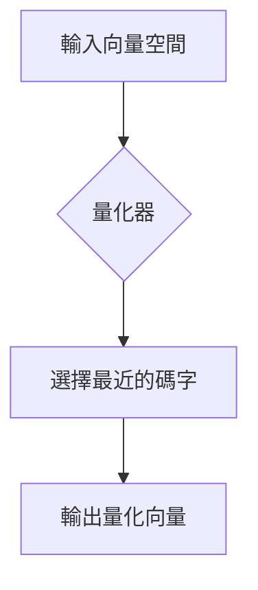

# Gersho's Influential Paper: Vector Quantization

[🏠 返回目錄](../index.md) | [返回 TurboQuant 翻譯主頁](03-turboquant-translation.md)

## 概述
Allen Gersho 在向量量化（Vector Quantization, VQ）領域具有奠基性的貢獻。他與 Robert M. Gray 合著的經典著作 *Vector Quantization and Signal Compression*（1992）是該領域的聖經。這篇論文及相關研究確立了利用向量而非純量進行信號壓縮的理論基礎。

## 核心概念：向量量化 (Vector Quantization)
傳統的量化（如 PCM）對每個樣本點進行量化。而向量量化則是將多個數據點組成一個「向量」，然後在向量空間中尋找最接近的「碼書」(Codebook) 中的向量（稱為碼字，Codeword）。

### 數學原理
給定一個 $k$ 維向量 $X \in \mathbb{R}^k$，向量量化器 $Q$ 將其映射到一個有限集合 $C = \{y_1, y_2, \dots, y_N\}$ 中，其中 $y_i \in \mathbb{R}^k$ 是碼字。

量化誤差（畸變，Distortion）通常以均方誤差 (MSE) 定義：
$$D = E[||X - Q(X)||^2]$$

## 實例說明
假設我們有 2 維空間中的數據點，我們希望將其壓縮為 4 個代表點。

1. **空間劃分**：Gersho 的理論與 Lloyd-Max 演算法密切相關，空間被劃分為 Voronoi 區域。
2. **尋找最佳點**：每個點 $x$ 被量化為其所屬 Voronoi 區域的重心 $y_i$。

### 視覺化說明
*(註：此處需參考 (../svg/vector_quantization_example.svg))*

*(請參考已存在的 `../svg/vector_quantization_example.svg` 獲取圖解)*

## 與 TurboQuant 的關聯
TurboQuant 利用向量量化來減少 Transformer 模型中 KV Cache 的儲存空間需求。透過將 KV 向量分塊進行量化，大幅降低了記憶體頻寬壓力。

[返回 TurboQuant 翻譯主頁](03-turboquant-translation.md)
