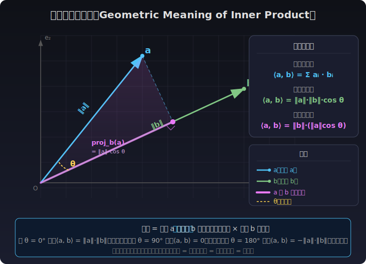
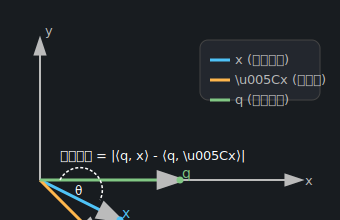
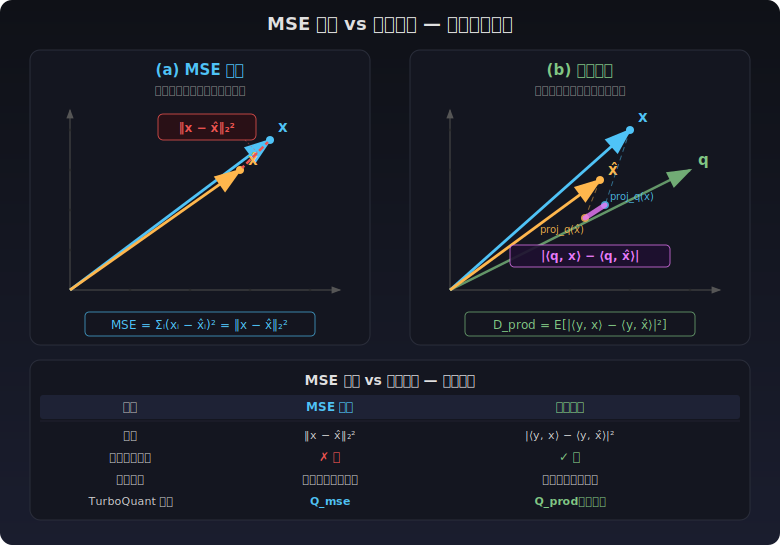
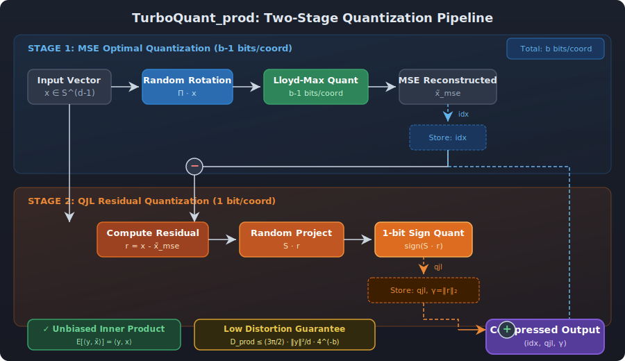
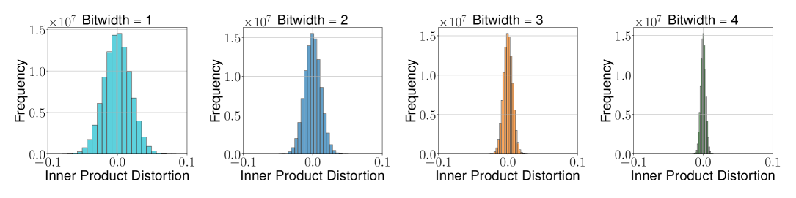
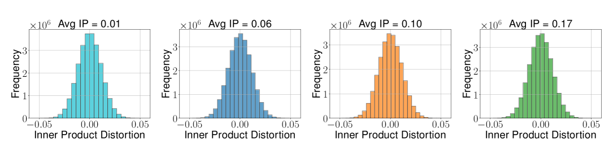

# 內積失真（Inner Product Distortion）深度解析

[🏠 返回目錄](../index.md) | [返回 TurboQuant 論文翻譯](03-turboquant-translation.md)

## 目錄

1. [視覺化總覽](#視覺化總覽)
2. [定義與背景](#定義與背景)
3. [形式化定義](#形式化定義)
4. [幾何意義](#幾何意義)
5. [為什麼 MSE 最佳量化器會引入內積偏差](#為什麼-mse-最佳量化器會引入內積偏差)
6. [TurboQuant 的兩階段解決方案](#turboquant-的兩階段解決方案)
7. [理論保證：定理 2 詳解](#理論保證定理-2-詳解)
8. [內積失真下界](#內積失真下界)
9. [與 MSE 失真的比較](#與-mse-失真的比較)
10. [實際計算範例](#實際計算範例)
11. [實驗驗證](#實驗驗證)
12. [在 KV Cache 量化中的應用](#在-kv-cache-量化中的應用)
13. [參考文獻與延伸閱讀](#參考文獻與延伸閱讀)

---

## 視覺化總覽

> 以下圖示提供了內積與內積失真的直覺理解，建議先看圖建立整體概念，再往下閱讀詳細的數學推導。

### 內積是什麼？

*圖示說明：兩個向量 **a** 和 **b** 的內積 ⟨a, b⟩ = ‖a‖·‖b‖·cos θ，幾何意義是向量 a 在向量 b 方向上的投影長度乘以向量 b 的長度。內積衡量兩個向量的「方向一致性」：正值 = 同方向，零 = 垂直，負值 = 反方向。*

### 內積失真的幾何表示

*圖示說明：原始向量 $\mathbf{x}$ 和查詢向量 $\mathbf{y}$ 的內積由投影長度決定；量化後向量 $\hat{\mathbf{x}}$ 的投影長度發生變化；內積失真 = 原始投影與量化後投影的差異。*

### 內積失真 vs. MSE 失真

*圖示說明：(a) MSE 衡量的是向量端點之間的歐氏距離 $\|\mathbf{x} - \hat{\mathbf{x}}\|_2^2$；(b) 內積失真衡量的是在查詢向量 $\mathbf{y}$ 方向上的投影差異 $|\langle\mathbf{y}, \mathbf{x}\rangle - \langle\mathbf{y}, \hat{\mathbf{x}}\rangle|^2$。*

### TurboQuant 兩階段方法流程

*圖示說明：TurboQuant_prod 的兩階段流程——先進行 MSE 最佳量化，再對殘差進行 QJL 變換，最終得到無偏的內積估計。*

---

## 定義與背景

在高維向量量化（Vector Quantization, VQ）中，除了常見的均方誤差（MSE, Mean Squared Error）外，**內積失真（Inner Product Distortion）** 是另一個極為重要的衡量指標。它描述的是：

> 當原始向量 $\mathbf{x}$ 被量化為 $\hat{\mathbf{x}}$ 後，與另一個查詢向量 $\mathbf{y}$ 的內積 $\langle \mathbf{y}, \mathbf{x} \rangle$ 與量化後的內積 $\langle \mathbf{y}, \hat{\mathbf{x}} \rangle$ 之間的誤差。

### 為什麼內積失真如此重要？

在現代 AI 和機器學習應用中，內積運算無處不在：

1. **注意力機制（Attention Mechanism）**：Transformer 模型中的 $\mathbf{Q}\mathbf{K}^T$ 運算本質上是 Query 與 Key 向量之間的內積，直接決定了注意力權重的分配。
2. **最近鄰搜尋（Nearest Neighbor Search）**：在高維向量資料庫中，透過內積或餘弦相似度來檢索最相關的向量。
3. **語意嵌入（Semantic Embeddings）**：語意相似度通常透過內積或餘弦相似度衡量。
4. **推薦系統**：用戶-物品交互通常建模為內積形式。

當這些向量被量化後，**內積計算的準確性直接影響系統性能**。正如 [TurboQuant 論文](03-turboquant-translation.md:60) 所指出的：

> 激活和權重之間的內積運算處於深度學習模型的核心。因此，模型量化方案致力於壓縮權重和/或激活向量，同時準確地保留這些內積。

---

## 形式化定義

### 基本定義

給定：
- 原始向量 $\mathbf{x} \in \mathbb{R}^d$
- 量化後向量 $\hat{\mathbf{x}} = Q^{-1}(Q(\mathbf{x})) \in \mathbb{R}^d$
- 查詢向量 $\mathbf{y} \in \mathbb{R}^d$

**內積誤差**定義為：

$$
\text{Inner Product Error} = \langle \mathbf{y}, \mathbf{x} \rangle - \langle \mathbf{y}, \hat{\mathbf{x}} \rangle = \langle \mathbf{y}, \mathbf{x} - \hat{\mathbf{x}} \rangle
$$

### TurboQuant 論文中的正式定義

根據 [TurboQuant 論文](03-turboquant-translation.md:148)，內積失真度量被正式定義為期望平方誤差：

$$
D_{\text{prod}} := \mathbb{E}_Q\left[|\langle\mathbf{y},\mathbf{x}\rangle - \langle\mathbf{y},Q^{-1}(Q(\mathbf{x}))\rangle|^2\right] \tag{2}
$$

其中期望是相對於量化器 $Q(\cdot)$ 的隨機性而言的。

### 無偏性要求

對於內積量化器，TurboQuant 論文提出了一個關鍵的**無偏性要求**：

$$
\mathbb{E}_Q[\langle\mathbf{y},Q^{-1}(Q(\mathbf{x}))\rangle] = \langle\mathbf{y},\mathbf{x}\rangle \tag{無偏內積}
$$

這意味著，**在期望意義下，量化後的內積估計應等於真實內積**。這個要求在許多應用中至關重要——例如在最近鄰搜尋中，有偏的內積估計會系統性地偏好或排斥某些向量，導致搜尋結果失真。

### 柯西-施瓦茨不等式上界

根據柯西-施瓦茨不等式（Cauchy-Schwarz Inequality），內積誤差的一個自然上界為：

$$
\left| \langle \mathbf{y}, \mathbf{x} - \hat{\mathbf{x}} \rangle \right| \leq \|\mathbf{y}\|_2 \cdot \|\mathbf{x} - \hat{\mathbf{x}}\|_2
$$

這告訴我們：
- 內積誤差的上界由查詢向量的範數和量化誤差範數的乘積決定
- 當 $\mathbf{y}$ 固定時，最小化 $\|\mathbf{x} - \hat{\mathbf{x}}\|_2$（即 MSE）有助於減少內積誤差
- **但是**，MSE 最優 ≠ 內積誤差最優！這是 TurboQuant 論文的核心洞察之一

---

## 幾何意義

### 投影解釋

內積 $\langle \mathbf{y}, \mathbf{x} \rangle$ 可以理解為向量 $\mathbf{x}$ 在向量 $\mathbf{y}$ 方向上的投影長度（乘以 $\|\mathbf{y}\|$）：

$$
\langle \mathbf{y}, \mathbf{x} \rangle = \|\mathbf{y}\|_2 \cdot \|\mathbf{x}\|_2 \cdot \cos\theta
$$

其中 $\theta$ 是 $\mathbf{y}$ 和 $\mathbf{x}$ 之間的夾角。

因此，內積誤差來源於兩個方面：

1. **長度誤差**：$\|\mathbf{x}\|_2$ 與 $\|\hat{\mathbf{x}}\|_2$ 的差異
2. **角度誤差**：$\cos\theta$ 的變化，即量化可能改變了向量的方向

### 關鍵洞察

即使量化後的向量 $\hat{\mathbf{x}}$ 在歐氏距離上接近 $\mathbf{x}$（MSE 小），如果量化導致方向改變，內積誤差仍可能很大。更嚴重的是，**MSE 最佳量化器可能系統性地引入內積偏差**，這不是隨機誤差，而是系統性的偏移。

---

## 為什麼 MSE 最佳量化器會引入內積偏差

這是 TurboQuant 論文最核心的洞察之一。論文在 [Section 3.2](03-turboquant-translation.md:826) 中明確指出：

> MSE 最佳量化器對於內積估計是**有偏的**，因此需要不同的 VQ 方案來獲得無偏的內積量化器。

### 偏差的數學分析

考慮 $\text{TurboQuant}_{\text{mse}}$ 在位元寬度 $b=1$ 的情況。對於足夠大的 $d$，最佳碼本為 $\{\pm\sqrt{\frac{2}{\pi d}}\}$，因此：

- 量化映射：$Q_{\text{mse}}(\mathbf{x}) = \text{sign}(\mathbf{\Pi} \cdot \mathbf{x})$
- 反量化映射：$Q_{\text{mse}}^{-1}(\mathbf{z}) = \sqrt{\frac{2}{\pi d}} \cdot \mathbf{\Pi}^\top \cdot \mathbf{z}$

對於內積估計，我們得到：

$$
\mathbb{E}[\langle\mathbf{y},Q_{\text{mse}}^{-1}(Q_{\text{mse}}(\mathbf{x}))\rangle] = \sqrt{\frac{2}{\pi}} \cdot \langle\mathbf{y},\mathbf{x}\rangle \approx 0.798 \cdot \langle\mathbf{y},\mathbf{x}\rangle
$$

這意味著 **MSE 最佳量化器系統性地低估了內積**，乘法偏差約為 $\sqrt{2/\pi} \approx 0.798$。換句話說，真實內積被系統性地壓縮到了約 79.8%。

### 偏差產生的根本原因

1. **純量量化的非線性效應**：MSE 最佳的純量量化器（如 Lloyd-Max 量化器）針對最小化 $\mathbb{E}[(x - \hat{x})^2]$ 設計，量化函數 $Q(x)$ 是非線性的。

2. **非線性導致期望不可交換**：由於量化的非線性，$\mathbb{E}[\langle\mathbf{y}, Q(\mathbf{x})\rangle] \neq \langle\mathbf{y}, \mathbb{E}[Q(\mathbf{x})]\rangle$，即期望和量化操作不可交換。

3. **系統性偏移**：某些量化區間的重建值可能系統性地偏向某一側，導致內積估計出現系統性偏差。

4. **低位元寬度下偏差更嚴重**：隨著位元寬度 $b$ 的增加，偏差逐漸減小並趨近於零，但在低位元寬度（如 $b=1,2$）下偏差顯著。

### 偏差隨位元寬度變化的趨勢

| 位元寬度 $b$ | MSE 量化器的內積偏差趨勢 |
|:---:|:---:|
| 1 | 偏差最大（$\approx \sqrt{2/\pi} \approx 0.798$ 的乘法因子） |
| 2 | 偏差顯著減小 |
| 3 | 偏差進一步減小 |
| 4+ | 偏差趨近於零 |

這一觀察也解釋了為什麼 TurboQuant 的內積量化器 $Q_{\text{prod}}$ 在低位元寬度下特別重要。

---

## TurboQuant 的兩階段解決方案

為了解決 MSE 量化器的內積偏差問題，TurboQuant 提出了一個優雅的**兩階段方法**，這是論文的核心創新之一。

### 演算法概述

**$\text{TurboQuant}_{\text{prod}}$**（[演算法 2](03-turboquant-translation.md:880)）的流程如下：

1. **第一階段**：應用位元寬度為 $b-1$ 的 MSE 最佳量化器 $Q_{\text{mse}}$
   - 將 $\mathbf{x}$ 量化為 $\hat{\mathbf{x}}_{\text{mse}} = \text{DeQuant}_{\text{mse}}(\text{Quant}_{\text{mse}}(\mathbf{x}))$
   - 這一步最小化了重建誤差的 L2 範數

2. **第二階段**：計算殘差向量 $\mathbf{r} = \mathbf{x} - \hat{\mathbf{x}}_{\text{mse}}$，並對其應用 1-bit QJL 變換
   - 殘差 $\mathbf{r}$ 的 L2 範數很小（因為第一階段已經最小化了 MSE）
   - 對 $\mathbf{r}$ 應用 QJL：$\text{qjl} = \text{sign}(\mathbf{S} \cdot \mathbf{r})$
   - QJL 是無偏的，這消除了第一階段引入的偏差

3. **最終重建**：
$$
\hat{\mathbf{x}} = \hat{\mathbf{x}}_{\text{mse}} + \sqrt{\frac{\pi}{2d}} \cdot \|\mathbf{r}\|_2 \cdot \mathbf{S}^\top \cdot \text{qjl}
$$

### 為什麼兩階段方法能消除偏差？

關鍵的數學洞察在於：

$$
\langle\mathbf{y}, \hat{\mathbf{x}}\rangle = \underbrace{\langle\mathbf{y}, \hat{\mathbf{x}}_{\text{mse}}\rangle}_{\text{MSE 量化器的內積估計}} + \underbrace{\langle\mathbf{y}, \hat{\mathbf{x}}_{\text{qjl}}\rangle}_{\text{QJL 對殘差的內積估計}}
$$

由 QJL 的無偏性（[引理 4](03-turboquant-translation.md:542)）：

$$
\mathbb{E}[\langle\mathbf{y}, \hat{\mathbf{x}}_{\text{qjl}}\rangle | \hat{\mathbf{x}}_{\text{mse}}] = \langle\mathbf{y}, \mathbf{r}\rangle = \langle\mathbf{y}, \mathbf{x}\rangle - \langle\mathbf{y}, \hat{\mathbf{x}}_{\text{mse}}\rangle
$$

因此：

$$
\mathbb{E}[\langle\mathbf{y}, \hat{\mathbf{x}}\rangle] = \langle\mathbf{y}, \hat{\mathbf{x}}_{\text{mse}}\rangle + \langle\mathbf{y}, \mathbf{x} - \hat{\mathbf{x}}_{\text{mse}}\rangle = \langle\mathbf{y}, \mathbf{x}\rangle
$$

**QJL 對殘差的無偏估計恰好補償了 MSE 量化器的偏差！**

### 量化映射的正式定義

更正式地，內積最佳量化映射 $Q_{\text{prod}}:\mathbb{S}^{d-1} \to [2^{b-1}]^d \times \{-1,1\}^d \times \mathbb{R}$ 定義為：

$$
Q_{\text{prod}}(\mathbf{x}) = [Q_{\text{mse}}(\mathbf{x}),\; Q_{\text{qjl}}(\mathbf{x} - Q_{\text{mse}}^{-1}(Q_{\text{mse}}(\mathbf{x}))),\; \|\mathbf{x} - Q_{\text{mse}}^{-1}(Q_{\text{mse}}(\mathbf{x}))\|_2]
$$

輸出包含三個部分：
- **idx**：MSE 量化器的索引向量（$(b-1)$ 位元/座標）
- **qjl**：QJL 的符號向量（1 位元/座標）
- **γ**：殘差向量的 L2 範數（一個純量，以浮點精度存儲）

---

## 理論保證：定理 2 詳解

TurboQuant 論文的 [定理 2](03-turboquant-translation.md:938) 給出了 $\text{TurboQuant}_{\text{prod}}$ 的完整性能保證：

### 定理陳述

對於任何位元寬度 $b \geq 1$ 和任何向量 $\mathbf{x} \in \mathbb{S}^{d-1}$，$\text{TurboQuant}_{\text{prod}}$ 產生的重建向量 $\tilde{\mathbf{x}} \in \mathbb{R}^d$ 對於任何向量 $\mathbf{y} \in \mathbb{R}^d$ 滿足以下性質：

**1. 無偏性：**

$$
\mathbb{E}_{\tilde{\mathbf{x}}}[\langle\mathbf{y},\tilde{\mathbf{x}}\rangle] = \langle\mathbf{y},\mathbf{x}\rangle
$$

**2. 內積失真上界：**

$$
D_{\text{prod}} := \mathbb{E}_{\tilde{\mathbf{x}}}[|\langle\mathbf{y},\mathbf{x}\rangle - \langle\mathbf{y},\tilde{\mathbf{x}}\rangle|^2] \leq \frac{3\pi}{2} \cdot \frac{\|\mathbf{y}\|_2^2}{d} \cdot \frac{1}{4^b}
$$

**3. 小位元寬度的精細界限：**

| 位元寬度 $b$ | $D_{\text{prod}}$ 的上界 |
|:---:|:---:|
| 1 | $\approx \frac{1.57}{d}$ |
| 2 | $\approx \frac{0.56}{d}$ |
| 3 | $\approx \frac{0.18}{d}$ |
| 4 | $\approx \frac{0.047}{d}$ |

### 證明思路

定理 2 的證明分為兩個部分：

**第一部分：無偏性證明**

計算內積估計在 $\tilde{\mathbf{x}}_{\text{mse}}$ 條件下的期望：

$$
\begin{aligned}
\mathbb{E}[\langle\mathbf{y},\tilde{\mathbf{x}}\rangle | \tilde{\mathbf{x}}_{\text{mse}}] &= \langle\mathbf{y},\tilde{\mathbf{x}}_{\text{mse}}\rangle + \mathbb{E}_{\tilde{\mathbf{x}}_{\text{qjl}}}[\langle\mathbf{y},\tilde{\mathbf{x}}_{\text{qjl}}\rangle | \tilde{\mathbf{x}}_{\text{mse}}] \\
&= \langle\mathbf{y},\tilde{\mathbf{x}}_{\text{mse}}\rangle + \langle\mathbf{y},\mathbf{r}\rangle \\
&= \langle\mathbf{y},\mathbf{x}\rangle
\end{aligned}
$$

其中第二步使用了 QJL 的無偏性（[引理 4](03-turboquant-translation.md:542)），第三步使用了殘差定義 $\mathbf{r} = \mathbf{x} - \tilde{\mathbf{x}}_{\text{mse}}$。然後由全期望定律得到無條件期望也等於 $\langle\mathbf{y},\mathbf{x}\rangle$。

**第二部分：失真上界證明**

對 $\tilde{\mathbf{x}}_{\text{mse}}$ 條件化後計算條件失真：

$$
\begin{aligned}
\mathbb{E}[|\langle\mathbf{y},\mathbf{x}\rangle - \langle\mathbf{y},\tilde{\mathbf{x}}\rangle|^2 | \tilde{\mathbf{x}}_{\text{mse}}] &= \text{Var}(\langle\mathbf{y},\tilde{\mathbf{x}}_{\text{qjl}}\rangle | \tilde{\mathbf{x}}_{\text{mse}}) \\
&\leq \frac{\pi}{2d} \cdot \|\mathbf{r}\|_2^2 \cdot \|\mathbf{y}\|_2^2
\end{aligned}
$$

然後由全期望定律：

$$
D_{\text{prod}} \leq \frac{\pi}{2d} \cdot \|\mathbf{y}\|_2^2 \cdot \mathbb{E}[\|\mathbf{x} - \tilde{\mathbf{x}}_{\text{mse}}\|_2^2] = \frac{\pi}{2d} \cdot \|\mathbf{y}\|_2^2 \cdot D_{\text{mse}}
$$

最後代入 [定理 1](03-turboquant-translation.md:738) 中位元寬度為 $b-1$ 的 MSE 界限即得結論。

---

## 內積失真下界

TurboQuant 論文的 [定理 3](03-turboquant-translation.md:1062) 給出了內積失真的資訊理論下界：

### 下界定理

對於任何具有位元寬度 $b$ 的隨機量化演算法 $Q:\mathbb{S}^{d-1} \to \{0,1\}^{b \cdot d}$ 和任何重建映射 $Q^{-1}$，存在困難的輸入實例 $\mathbf{x}, \mathbf{y} \in \mathbb{S}^{d-1}$ 使得：

$$
D_{\text{prod}}(Q) = \mathbb{E}[|\langle\mathbf{y},\mathbf{x}\rangle - \langle\mathbf{y},Q^{-1}(Q(\mathbf{x}))\rangle|^2] \geq \frac{\|\mathbf{y}\|_2^2}{d} \cdot \frac{1}{4^b}
$$

### 下界的證明思路

1. 利用 Yao 的 minimax 原理，將隨機演算法的最壞情況下界轉化為確定性演算法在隨機輸入上的下界。
2. 使用 [香農下界（SLB）](03-shannon-lower-bound) 建立 MSE 的下界：$D_{\text{mse}} \geq \frac{1}{4^b}$。
3. 由 MSE 的定義展開：

$$
D_{\text{mse}} = \sum_{j=1}^{d} \mathbb{E}[|\langle\mathbf{e}_j, \mathbf{x}\rangle - \langle\mathbf{e}_j, Q^{-1}(Q(\mathbf{x}))\rangle|^2] \geq \frac{1}{4^b}
$$

4. 由鴿巢原理，存在某個座標 $j$ 使得：

$$
\mathbb{E}[|\langle\mathbf{e}_j, \mathbf{x}\rangle - \langle\mathbf{e}_j, Q^{-1}(Q(\mathbf{x}))\rangle|^2] \geq \frac{1}{d} \cdot \frac{1}{4^b}
$$

### TurboQuant 的接近最佳性

將 TurboQuant 的上界與下界比較：

$$
\frac{D_{\text{prod}}^{\text{TurboQuant}}}{D_{\text{prod}}^{\text{Lower Bound}}} = \frac{\frac{3\pi}{2} \cdot \frac{\|\mathbf{y}\|_2^2}{d} \cdot \frac{1}{4^b}}{\frac{\|\mathbf{y}\|_2^2}{d} \cdot \frac{1}{4^b}} = \frac{3\pi}{2} \approx 4.71
$$

但對於小位元寬度，這個因子更小：

| 位元寬度 $b$ | TurboQuant 上界 / 下界 |
|:---:|:---:|
| 1 | $\approx 1.45$ |
| 2 | $\approx 1.17$ |
| 3 | $\approx 1.2$ |
| 4 | $\approx 1.26$ |

這證明 TurboQuant 的內積量化是 **near-optimal** 的——與理論下界僅相差一個小常數因子。

---

## 與 MSE 失真的比較

### 定義比較

| 特性 | MSE 失真 | 內積失真 |
|:---:|:---:|:---:|
| 數學定義 | $\|\mathbf{x} - \hat{\mathbf{x}}\|_2^2$ | $|\langle\mathbf{y}, \mathbf{x}\rangle - \langle\mathbf{y}, \hat{\mathbf{x}}\rangle|^2$ |
| 依賴查詢向量 | ❌ 否 | ✅ 是 |
| 幾何意義 | 歐氏距離平方 | 投影差異的平方 |
| 最佳化目標 | 重建準確性 | 任務特定準確性 |
| 無偏性要求 | 不需要 | 需要 |
| TurboQuant 變體 | $Q_{\text{mse}}$ | $Q_{\text{prod}}$ |

### 兩者之間的關係

TurboQuant 的證明揭示了一個優雅的關係——內積失真上界可以直接從 MSE 失真上界推導：

$$
D_{\text{prod}} \leq \frac{\pi}{2d} \cdot \|\mathbf{y}\|_2^2 \cdot D_{\text{mse}}
$$

這個關係式表明：
- **內積失真與 MSE 失真成正比**：最小化 MSE 是減少內積失真的必要條件
- **維度因子 $1/d$**：在高維空間中，內積失真自然較小，這是「測度集中」現象的體現
- **查詢向量範數的影響**：內積失真與 $\|\mathbf{y}\|_2^2$ 成正比，這解釋了為什麼論文假設 $\|\mathbf{x}\|_2 = 1$（單位範數假設）

### 為什麼不能只用 MSE 最佳量化器？

雖然最小化 MSE 有助於減少內積失真，但 MSE 最佳量化器**不保證內積估計的無偏性**。在需要精確內積估計的應用中（如最近鄰搜尋、注意力機制），有偏的內積估計會導致系統性誤差，這是無法透過增加位元寬度完全消除的。

---

## 實際計算範例

### 範例一：基本內積失真計算

假設有一個原始向量 $\mathbf{x} = [1.2, -0.7, 3.5]$，查詢向量 $\mathbf{y} = [2, 0, -1]$。

- 原始內積：$\langle \mathbf{y}, \mathbf{x} \rangle = 2 \times 1.2 + 0 \times (-0.7) + (-1) \times 3.5 = 2.4 - 3.5 = -1.1$
- 假設量化後 $\hat{\mathbf{x}} = [1, -1, 4]$
- 量化後內積：$\langle \mathbf{y}, \hat{\mathbf{x}} \rangle = 2 \times 1 + 0 \times (-1) + (-1) \times 4 = 2 - 4 = -2$
- 內積失真：$|-1.1 - (-2)|^2 = 0.81$

### 範例二：MSE 小但內積偏差大的情況

這個範例說明為什麼 MSE 最佳不等於內積最佳：

**設定：**
- 原始向量：$\mathbf{x} = [1, 0]$
- 查詢向量：$\mathbf{y} = [0, 1]$
- 量化器 C：$\hat{\mathbf{x}}_C = [0.9, 0.1]$（MSE = 0.02）
- 量化器 D：$\hat{\mathbf{x}}_D = [1.1, 0]$（MSE = 0.01）

| 量化器 | MSE | 原始內積 | 量化後內積 | 內積誤差 |
|:---:|:---:|:---:|:---:|:---:|
| C | 0.02 | 0 | 0.1 | **0.1** |
| D | 0.01 | 0 | 0 | **0** |

量化器 D 的 MSE 更小，同時內積誤差也為 0，因為它保持了與 $\mathbf{y}$ 正交的性質。但這不是一般情況——MSE 最佳化並不保證內積誤差最小。

### 範例三：TurboQuant 的兩階段方法

假設 $\mathbf{x} \in \mathbb{S}^{d-1}$（單位球面上的向量），$d = 128$，位元寬度 $b = 2$：

**第一階段（MSE 量化，$b-1=1$ 位元）：**
- 量化後：$\hat{\mathbf{x}}_{\text{mse}}$，MSE 失真 $\approx \frac{0.36}{d} = \frac{0.36}{128} \approx 0.0028$
- 殘差：$\mathbf{r} = \mathbf{x} - \hat{\mathbf{x}}_{\text{mse}}$，$\|\mathbf{r}\|_2^2 \approx 0.0028$

**第二階段（QJL，1 位元）：**
- 對殘差 $\mathbf{r}$ 應用 QJL 變換
- QJL 提供無偏的殘差內積估計

**最終內積失真上界：**

$$
D_{\text{prod}} \leq \frac{0.56}{d} = \frac{0.56}{128} \approx 0.0044
$$

---

## 實驗驗證

TurboQuant 論文在 [Section 4.1](03-turboquant-translation.md:1170) 中提供了詳細的實驗驗證：

### 實驗設置

- **數據集**：DBpedia Entities，使用 OpenAI3 嵌入編碼為 1536 維空間
- **訓練集**：100,000 個數據點
- **查詢集**：1,000 個查詢點
- **評估方法**：$\text{TurboQuant}_{\text{prod}}$ 和 $\text{TurboQuant}_{\text{mse}}$

### 關鍵發現

1. **$\text{TurboQuant}_{\text{prod}}$ 在所有位元寬度下保持無偏**：內積估計的期望值等於真實內積。

2. **$\text{TurboQuant}_{\text{mse}}$ 在低位元寬度下有顯著偏差**：特別是在 $b=1$ 時，偏差約為 $\sqrt{2/\pi} \approx 0.798$ 的乘法因子。

3. **偏差隨位元寬度增加而減小**：隨著 $b$ 增大，$\text{TurboQuant}_{\text{mse}}$ 的偏差逐漸趨近於零。

4. **$\text{TurboQuant}_{\text{prod}}$ 在低位元寬度下更優**：對於內積估計任務，$\text{TurboQuant}_{\text{prod}}$ 在低位元寬度下表現更好；隨著位元數增加，$\text{TurboQuant}_{\text{mse}}$ 的偏差減小，最終可達到更好的性能。

---

## 在 KV Cache 量化中的應用

### 問題陳述

在 Transformer 的 KV Cache 量化中，注意力機制的核心計算是：

$$
\text{Attention}(\mathbf{Q}, \mathbf{K}, \mathbf{V}) = \text{softmax}\left(\frac{\mathbf{Q}\mathbf{K}^T}{\sqrt{d}}\right)\mathbf{V}
$$

其中 $\mathbf{Q}\mathbf{K}^T$ 涉及大量的 Query-Key 內積運算。如果 Key 向量 $\mathbf{K}$ 被量化為 $\hat{\mathbf{K}}$，則內積失真直接影響注意力權重的計算：

$$
\text{真實注意力權重} = \text{softmax}\left(\frac{\mathbf{Q}\mathbf{K}^T}{\sqrt{d}}\right) \quad \text{vs.} \quad \text{量化注意力權重} = \text{softmax}\left(\frac{\mathbf{Q}\hat{\mathbf{K}}^T}{\sqrt{d}}\right)
$$

### 為什麼選擇 $\text{TurboQuant}_{\text{prod}}$？

對於 KV Cache 量化，$\text{TurboQuant}_{\text{prod}}$ 是更好的選擇，因為：

1. **無偏性保證**：注意力權重的期望值不受系統性偏差影響
2. **低位元寬度下的優勢**：在 2.5-3.5 bits/channel 的實際壓縮比下，無偏性至關重要
3. **理論保證**：內積失真有明確的上界，可以預測性能下降

### 實驗結果

根據 [TurboQuant 論文](03-turboquant-translation.md:1248) 的實驗：

- **3.5 bits/channel**：絕對品質中性（與全精度模型完全相同的性能）
- **2.5 bits/channel**：邊際品質下降
- **壓縮比**：超過 $5\times$ 的 KV Cache 壓縮

---

## 參考文獻與延伸閱讀

### 核心論文

- [TurboQuant 論文完整翻譯](03-turboquant-translation.md)
  - [內積失真定義（公式 2）](03-turboquant-translation.md:148)
  - [無偏性要求](03-turboquant-translation.md:174)
  - [MSE 量化器的偏差問題](03-turboquant-translation.md:826)
  - [TurboQuant_prod 演算法](03-turboquant-translation.md:880)
  - [定理 2：性能保證](03-turboquant-translation.md:938)
  - [定理 3：下界](03-turboquant-translation.md:1062)

### 相關概念

- [向量量化（Vector Quantization）](03-vector-quantization-explanation.md)
- [均方誤差（MSE）](03-mse-explanation.md)
- [內積誤差詳細解析](03-inner-product-errors.md)
- [QJL 詳解](03-qjl-explanation.md)
- [次佳失真界限](03-suboptimal-distortion-bounds.md)
- [Beta 分佈](03-beta-distribution.md)
- [Lloyd-Max 量化器](03-lloyd-max-quantizer.md)
- [香農信源編碼理論](03-shannon-source-coding-theory.md)
- [香農失真-率函數](03-shannon-distortion-rate-function.md)

---

[返回 TurboQuant 論文翻譯](03-turboquant-translation.md)

[深入了解內積誤差](03-inner-product-errors.md)

[深入了解 QJL](03-qjl-explanation.md)

---

> **本頁內容基於以下來源：**
> - TurboQuant 論文（arXiv:2504.19874v1）
> - [`03-turboquant-translation.md`](03-turboquant-translation.md) - 論文完整翻譯
> - [`03-inner-product-errors.md`](03-inner-product-errors.md) - 內積誤差詳細解析
> - [`03-suboptimal-distortion-bounds.md`](03-suboptimal-distortion-bounds.md) - 次佳失真界限解析
