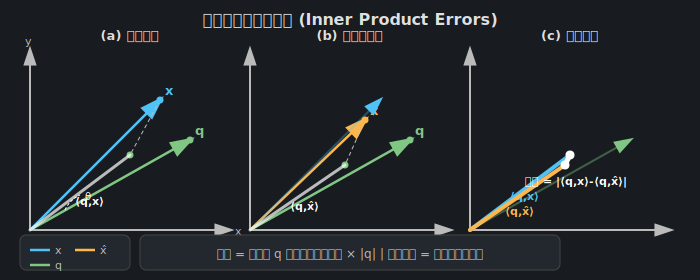

# Inner Product Errors（內積誤差）詳細解析

## 目錄

1. [定義與背景](#定義與背景)
2. [數學形式化定義](#數學形式化定義)
3. [幾何意義解釋](#幾何意義解釋)
4. [實際計算範例](#實際計算範例)
5. [內積誤差 vs MSE](#內積誤差-vs-mse)
6. [在 TurboQuant 中的應用](#在-turboquant-中的應用)
7. [視覺化圖示](#視覺化圖示)

---

## 定義與背景

**Inner Product Errors（內積誤差）** 是向量量化（Vector Quantization）領域中一個關鍵的失真衡量指標。這個概念在 [`03-turboquant-translation.md:29`](03-turboquant-translation.md:29) 的引言中被首次提及：

> 核心目標是透過量化來壓縮高維向量——將浮點座標值轉換為低位元寬度整數——同時最小化失真，失真可由均方誤差（MSE）或**內積誤差**等指標來量化。

### 為什麼內積誤差如此重要？

在現代 AI 和機器學習應用中，內積運算無處不在：

1. **注意力機制（Attention Mechanism）**：Transformer 模型中的 QK^T 運算本質上是內積
2. **最近鄰搜尋（Nearest Neighbor Search）**：通過內積相似度來檢索最相關的向量
3. **語意嵌入（Semantic Embeddings）**：語意相似度通常通過內積或餘弦相似度衡量
4. **推薦系統**：用戶 - 物品交互通常建模為內積形式

當這些向量被量化後，內積計算的準確性直接影響系統性能。

---

## 數學形式化定義

### 基本定義

給定：
- 原始向量 $\mathbf{x} \in \mathbb{R}^d$
- 量化後向量 $\hat{\mathbf{x}} \in \mathbb{R}^d$
- 查詢向量 $\mathbf{q} \in \mathbb{R}^d$

**內積誤差**定義為：

$$
\text{Inner Product Error} = \langle \mathbf{q}, \mathbf{x} \rangle - \langle \mathbf{q}, \hat{\mathbf{x}} \rangle = \langle \mathbf{q}, \mathbf{x} - \hat{\mathbf{x}} \rangle
$$

### 絕對內積誤差

在實際應用中，我們通常關心絕對誤差：

$$
|\text{Inner Product Error}| = \left| \langle \mathbf{q}, \mathbf{x} \rangle - \langle \mathbf{q}, \hat{\mathbf{x}} \rangle \right|
$$

### 期望內積誤差（統計視角）

當考慮向量的統計分佈時，我們可以定義期望內積誤差：

$$
\mathbb{E}\left[ \left| \langle \mathbf{q}, \mathbf{x} \rangle - \langle \mathbf{q}, \hat{\mathbf{x}} \rangle \right| \right]
$$

### 柯西 - 施瓦茨不等式 bound

根據柯西 - 施瓦茨不等式（Cauchy-Schwarz Inequality）：

$$
\left| \langle \mathbf{q}, \mathbf{x} - \hat{\mathbf{x}} \rangle \right| \leq \|\mathbf{q}\|_2 \cdot \|\mathbf{x} - \hat{\mathbf{x}}\|_2
$$

這告訴我們：
- 內積誤差的上界由查詢向量的範數和量化誤差範數的乘積決定
- 當 $\mathbf{q}$ 固定時，最小化 $\|\mathbf{x} - \hat{\mathbf{x}}\|_2$（即 MSE）有助於減少內積誤差
- **但是**，MSE 最優不等於內積誤差最優！

---

## 幾何意義解釋

### 投影解釋

內積 $\langle \mathbf{q}, \mathbf{x} \rangle$ 可以理解為：

$$
\langle \mathbf{q}, \mathbf{x} \rangle = \|\mathbf{q}\|_2 \cdot \|\mathbf{x}\|_2 \cdot \cos\theta
$$

其中 $\theta$ 是 $\mathbf{q}$ 和 $\mathbf{x}$ 之間的夾角。

因此，內積誤差來源於兩個方面：

1. **長度誤差**：$\|\mathbf{x}\|_2$ 與 $\|\hat{\mathbf{x}}\|_2$ 的差異
2. **角度誤差**：$\cos\theta$ 的變化

### 關鍵洞察

即使量化後的向量 $\hat{\mathbf{x}}$ 在歐氏距離上接近 $\mathbf{x}$（MSE 小），如果量化導致方向改變，內積誤差仍可能很大。

---

## 實際計算範例

### 範例一：簡單三維向量

這個範例展示內積���差的計算過程：

**設定：**
- 原始向量：$\mathbf{x} = [1.2, -0.7, 3.5]$
- 查詢向量：$\mathbf{q} = [2, 0, -1]$
- 量化後向量：$\hat{\mathbf{x}} = [1, -1, 4]$（假設 4 級量化）

**計算步驟：**

1. **原始內積：**
   $$
   \langle \mathbf{q}, \mathbf{x} \rangle = 2 \times 1.2 + 0 \times (-0.7) + (-1) \times 3.5 = 2.4 - 3.5 = -1.1
   $$

2. **量化後內積：**
   $$
   \langle \mathbf{q}, \hat{\mathbf{x}} \rangle = 2 \times 1 + 0 \times (-1) + (-1) \times 4 = 2 - 4 = -2
   $$

3. **內積誤差：**
   $$
   \text{Error} = -1.1 - (-2) = 0.9
   $$

4. **相對誤差：**
   $$
   \text{Relative Error} = \frac{0.9}{|-1.1|} \approx 81.8\%
   $$

### 範例二：MSE 小但內積誤差大的情況

這個範例說明為什麼 MSE 最優不等於內積誤差最優：

**設定：**
- 原始向量：$\mathbf{x} = [10, 0, 0]$
- 查詢向量：$\mathbf{q} = [1, 0, 0]$
- 量化器 A：$\hat{\mathbf{x}}_A = [9, 1, 0]$
- 量化器 B：$\hat{\mathbf{x}}_B = [9.5, 0, 0]$

**比較：**

| 量化器 | MSE | 原始內積 | 量化後內積 | 內積誤差 |
|--------|-----|----------|------------|----------|
| A | $(10-9)^2 + (0-1)^2 = 2$ | 10 | 9 | 1 |
| B | $(10-9.5)^2 = 0.25$ | 10 | 9.5 | 0.5 |

在這個例子中，量化器 B 的 MSE 更小，內積誤差也更小。但這不總是成立！

**反例：**
- 原始向量：$\mathbf{x} = [1, 0]$
- 查詢向量：$\mathbf{q} = [0, 1]$
- 量化器 C：$\hat{\mathbf{x}}_C = [0.9, 0.1]$
- 量化器 D：$\hat{\mathbf{x}}_D = [1.1, 0]$

| 量化器 | MSE | 原始內積 | 量化後內積 | 內積誤差 |
|--------|-----|----------|------------|----------|
| C | $0.1^2 + 0.1^2 = 0.02$ | 0 | 0.1 | **0.1** |
| D | $0.1^2 = 0.01$ | 0 | 0 | **0** |

量化器 D 的 MSE 更小，同時內積誤差也為 0，因為它保持了與 $\mathbf{q}$ 正交的性質。

### 範例三：高維情境（KV Cache 量化）

在 Transformer 的 KV Cache 量化場景中：

- 向量維度：$d = 128$ 或 $256$
- 原始向量：$\mathbf{x} \in \mathbb{R}^{128}$（Key 或 Value 向量）
- 查詢向量：$\mathbf{q} \in \mathbb{R}^{128}$（Query 向量）
- 量化位元：2.5 或 3.5 bits per channel

根據 TurboQuant 論文的結果：
- 在 3.5 bits/channel 時，內積誤差足夠小，達到「品質中性」
- 在 2.5 bits/channel 時，有邊際的品質下降

---

## 內積誤差 vs MSE

### 定義比較

| 特性 | MSE（均方誤差） | 內積誤差 |
|------|----------------|----------|
| 數學定義 | $\|\mathbf{x} - \hat{\mathbf{x}}\|_2^2$ | $\langle \mathbf{q}, \mathbf{x} - \hat{\mathbf{x}} \rangle$ |
| 依賴查詢向量 | ❌ 否 | ✅ 是 |
| 幾何意義 | 歐氏距離平方 | 投影差異 |
| 最佳化目標 | 重建準確性 | 任務特定準確性 |

### 為什麼 MSE 最佳量化器會引入內積偏差？

如 [`03-turboquant-translation.md:17`](03-turboquant-translation.md:17) 所述：

> 認識到 MSE 最佳量化器會在內積估計中引入偏差，我們提出了一個兩階段方法...

**原因分析：**

1. **純量量化偏差**：MSE 最佳的純量量化器（如 Lloyd-Max 量化器）針對最小化 $\mathbb{E}[(x - \hat{x})^2]$ 設計
2. **非線性效應**：量化函數 $Q(x)$ 是非線性的，導致 $\mathbb{E}[\langle \mathbf{q}, Q(\mathbf{x}) \rangle] \neq \langle \mathbf{q}, \mathbb{E}[Q(\mathbf{x})] \rangle$
3. **系統性偏移**：某些量化區間的重建值可能系統性地偏向某一側

### TurboQuant 的解決方案

TurboQuant 採用兩階段方法來解決這個問題：

1. **第一階段**：應用 MSE 最佳量化器 $\hat{\mathbf{x}}_{\text{MSE}}$
2. **第二階段**：對殘差 $\mathbf{r} = \mathbf{x} - \hat{\mathbf{x}}_{\text{MSE}}$ 應用 1-bit QJL 變換

最終估計：
$$
\langle \mathbf{q}, \mathbf{x} \rangle \approx \langle \mathbf{q}, \hat{\mathbf{x}}_{\text{MSE}} \rangle + \text{QJL}(\langle \mathbf{q}, \mathbf{r} \rangle)
$$

這個方法產生**無偏的內積估計**。

---

## 在 TurboQuant 中的應用

### 問題陳述

在 KV Cache 量化中，我們需要高效計算：

$$
\text{Attention}(\mathbf{Q}, \mathbf{K}, \mathbf{V}) = \text{softmax}\left(\frac{\mathbf{Q}\mathbf{K}^T}{\sqrt{d}}\right)\mathbf{V}
$$

其中 $\mathbf{Q}\mathbf{K}^T$ 涉及大量的內積運算。

### TurboQuant 的貢獻

根據 [`03-turboquant-translation.md:17-21`](03-turboquant-translation.md:17)：

1. **隨機旋轉**：將輸入向量隨機旋轉，誘導座標上產生集中的 Beta 分佈
2. **純量量化**：利用高維度中不同座標的近似獨立性，對每個座標應用最佳純量量化器
3. **兩階段內積估計**：
   - MSE 量化器 + 1-bit QJL 殘差修正
   - 達到無偏的內積估計

### 實驗結果

- **KV Cache 量化**：
  - 3.5 bits/channel：絕對品質中性
  - 2.5 bits/channel：邊際品質下降

- **最近鄰搜尋**：
  - 召回率優於現有乘積量化技術
  - 索引時間減少到幾乎為零

---

## 視覺化圖示

### 內積誤差的幾何表示

*圖示說明：(a) 原始向量 $\mathbf{x}$ 和查詢向量 $\mathbf{q}$ 的內積由投影長度決定；(b) 量化後向量 $\hat{\mathbf{x}}$ 的投影長度發生變化；(c) 內積誤差 = 原始投影 - 量化後投影*

### 與 MSE 的比較

*圖示說明：(a) MSE 衡量的是向量端點之間的歐氏距離 $\|\mathbf{x} - \hat{\mathbf{x}}\|_2^2$；(b) 內積誤差衡量的是在查詢向量 $\mathbf{q}$ 方向上的投影差異 $|\langle \mathbf{q}, \mathbf{x} \rangle - \langle \mathbf{q}, \hat{\mathbf{x}} \rangle|$*

---

## 參考文獻與延伸閱讀

- 原文出處：[`03-turboquant-translation.md:29`](03-turboquant-translation.md:29)
- 相關概念：
  - [向量量化（Vector Quantization）](03-vector-quantization-explanation.md)
  - [均方誤差（MSE）](03-mse-explanation.md)
  - [內積失真（Inner Product Distortion）](03-inner-product-distortion.md)
  - [香農信源編碼理論](03-shannon-source-coding-theory.md)

---

## 返回連結

- [返回 TurboQuant 論文翻譯 - 引言](03-turboquant-translation.md:29)
- [返回 TurboQuant 論文翻譯 - 摘要](03-turboquant-translation.md:17)

---

> **本頁內容引用自：**
> - [`03-turboquant-translation.md:17`](03-turboquant-translation.md:17) - 摘要部分
> - [`03-turboquant-translation.md:21`](03-turboquant-translation.md:21) - 摘要中文翻譯
> - [`03-turboquant-translation.md:29`](03-turboquant-translation.md:29) - 引言部分
> - [`03-turboquant-translation.md:33`](03-turboquant-translation.md:33) - 引言中文翻譯
>
> **相關文件：**
> - [向量量化說明](03-vector-quantization-explanation.md)
> - [MSE 說明](03-mse-explanation.md)
> - [內積失真說明](03-inner-product-distortion.md)
