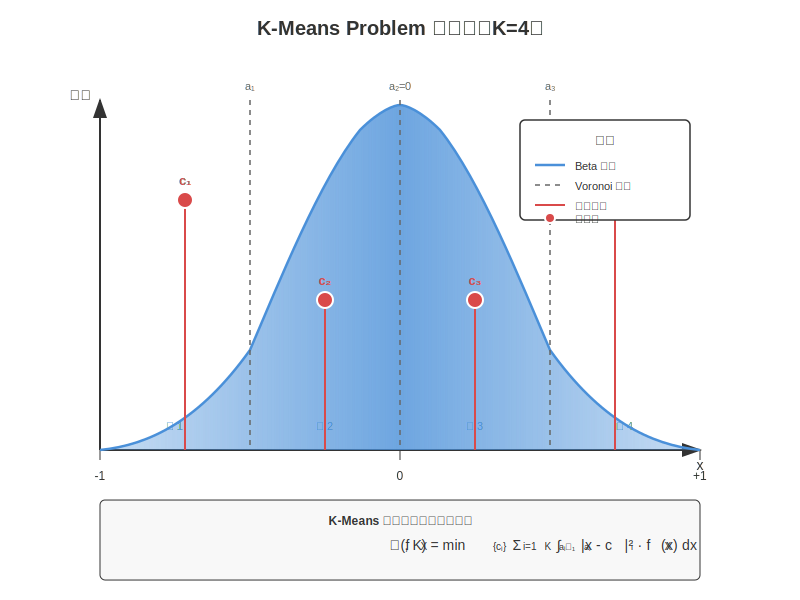

# K-Means Problem 詳細解說

[🏠 返回目錄](../index.md)

> **相關連結：** [返回 TurboQuant 論文翻譯](03-turboquant-translation.md) | [Lloyd-Max 量化器](03-lloyd-max-quantizer.md) | [Beta 分佈](03-beta-distribution.md)

---

## 目錄

1. [什麼是 K-Means Problem？](#什麼是-k-means-problem)
2. [K-Means 在 TurboQuant 中的應用](#k-means-在-turboquant-中的應用)
3. [連續 K-Means 問題](#連續-k-means-問題)
4. [數學原理](#數學原理)
5. [實例解說](#實例解說)
6. [視覺化圖解](#視覺化圖解)
7. [Lloyd-Max 演算法](#lloyd-max-演算法)
8. [參考資料](#參考資料)

---

## 什麼是 K-Means Problem？

**K-Means Problem（K-平均問題）** 是一個經典的聚類（clustering）優化問題，其目標是將一組數據點劃分為 K 個簇（clusters），使得每個數據點都屬於離它最近的簇中心（centroid）所對應的簇，並且所有數據點到其對應簇中心的距離平方和最小。

### 形式化定義

給定一組數據點 $\{x_1, x_2, \ldots, x_n\}$ 和一個預期的簇數量 $K$，K-Means 問題尋找 $K$ 個簇中心 $\{c_1, c_2, \ldots, c_K\}$，使得以下目標函數最小化：

$$
\min_{c_1, \ldots, c_K} \sum_{i=1}^{n} \min_{j \in \{1,\ldots,K\}} \|x_i - c_j\|^2
$$

其中 $\|x_i - c_j\|^2$ 表示數據點 $x_i$ 到簇中心 $c_j$ 的歐幾里得距離的平方。

### 等價的簇劃分形式

如果我們用 $S_j$ 表示第 $j$ 個簇中的所有數據點的集合，那麼 K-Means 問題可以等價地寫成：

$$
\min_{S_1, \ldots, S_K} \sum_{j=1}^{K} \sum_{x_i \in S_j} \|x_i - c_j\|^2
$$

其中每個簇中心 $c_j$ 是該簇中所有數據點的平均值：

$$
c_j = \frac{1}{|S_j|} \sum_{x_i \in S_j} x_i
$$

---

## K-Means 在 TurboQuant 中的應用

在 TurboQuant 論文中，K-Means Problem 出現在 **MSE 最佳量化器** 的設計過程中。具體來說：

1. **隨機旋轉**：TurboQuant 首先對輸入向量應用隨機旋轉，使得每個座標遵循 Beta 分佈。

2. **純量量化**：由於高維度中不同座標近似獨立，TurboQuant 可以對每個座標獨立地應用最佳純量量化器。

3. **連續 K-Means**：設計最佳純量量化器等價於解決一個**連續一維 K-Means 問題**，其中：
   - $K = 2^b$（$b$ 是位元寬度）
   - 數據分佈是 Beta 分佈 $f_X(x)$
   - 目標是最小化期望 MSE

正如論文第 89 行所述：

> "我們透過使用 Max-Lloyd 演算法解決連續一維 k-means 問題，找到具有 Beta 分佈的隨機變量的最佳純量量化器。"

---

## 連續 K-Means 問題

在 TurboQuant 的脈絡中，我們面對的是**連續 K-Means 問題**，而不是傳統的離散 K-Means。兩者的主要區別在於：

| 特性 | 離散 K-Means | 連續 K-Means |
|------|-------------|-------------|
| 數據 | 有限個數據點 | 連續機率分佈 |
| 目標 | 最小化數據點到簇中心的距離和 | 最小化期望距離（積分） |
| 權重 | 每個數據點權重相同 | 由機率密度函數決定權重 |

### 連續 K-Means 的目標函數

對於一維連續分佈 $f_X(x)$，連續 K-Means 問題尋找 $K$ 個質心 $\{c_1, c_2, \ldots, c_K\}$，使得：

$$
\mathcal{C}(f_X, K) := \min_{c_1 \leq c_2 \leq \ldots \leq c_K} \sum_{i=1}^{K} \int_{a_{i-1}}^{a_i} |x - c_i|^2 \cdot f_X(x) \, dx
$$

其中邊界點 $a_i$ 定義為相鄰質心的中點：

$$
a_i = \frac{c_i + c_{i+1}}{2}, \quad \text{對於 } i = 1, \ldots, K-1
$$

且 $a_0 = -\infty$，$a_K = +\infty$（或在有界區間的情況下為區間端點）。

---

## 數學原理

### Voronoi 鑲嵌（Voronoi Tessellation）

最佳 K-Means 解遵循 **Voronoi 鑲嵌** 性質：每個數據點被分配給最近的質心。在一維情況下，這意味著區間邊界是相鄰質心的中點。

### 最優質心條件

對於給定的劃分邊界 $\{a_0, a_1, \ldots, a_K\}$，最優質心 $c_i$ 必須滿足：

$$
c_i = \frac{\int_{a_{i-1}}^{a_i} x \cdot f_X(x) \, dx}{\int_{a_{i-1}}^{a_i} f_X(x) \, dx}
$$

這表示每個質心是其對應區間內分佈的**條件期望值**。

### Beta 分佈的 K-Means

在 TurboQuant 中，分佈 $f_X(x)$ 是 Beta 分佈：

$$
f_X(x) = \frac{\Gamma(d/2)}{\sqrt{\pi} \cdot \Gamma((d-1)/2)} (1 - x^2)^{(d-3)/2}, \quad x \in [-1, 1]
$$

在高維度 $d$ 下，這個分佈收斂於常態分佈 $\mathcal{N}(0, 1/d)$。

---

## 實例解說

### 範例：1 位元量化（K = 2）

考慮最簡單的情況：$b = 1$ 位元量化，這意味著 $K = 2^1 = 2$ 個簇。

假設分佈是對稱的（如 Beta 分佈在高維度下近似對稱），那麼兩個最優質心將關於原點對稱：

$$
c_1 = -c, \quad c_2 = +c
$$

邊界點在原點：$a_1 = 0$。

對於標準常態分佈 $\mathcal{N}(0, \sigma^2)$，最優質心可以計算為：

$$
c = \sqrt{\frac{2}{\pi}} \cdot \sigma
$$

在 TurboQuant 的脈絡中，$\sigma = 1/\sqrt{d}$，所以：

$$
c = \sqrt{\frac{2}{\pi d}}
$$

這與論文第 617 行給出的結果一致。

### 範例：2 位元量化（K = 4）

對於 $b = 2$ 位元量化，$K = 2^2 = 4$ 個簇。

由於對稱性，四個質心將是：

$$
c_1 = -c_2, \quad c_3 = -c_4
$$

其中 $c_1 < c_2 < 0 < c_3 < c_4$。

論文第 617 行給出了近似值：

$$
\{c_1, c_2, c_3, c_4\} \approx \left\{-\frac{1.51}{\sqrt{d}}, -\frac{0.453}{\sqrt{d}}, \frac{0.453}{\sqrt{d}}, \frac{1.51}{\sqrt{d}}\right\}
$$

---

## 視覺化圖解

### K-Means 聚類視覺化



上圖展示了當 $K=4$ 時的 K-Means 聚類過程：

- **藍色曲線**：Beta 分佈 $f_X(x)$，表示數據點的機率密度
- **灰色虛線**：Voronoi 邊界 $a_1, a_2, a_3$，將數據空間劃分為 4 個區域
- **紅色垂直線**：每個簇的質心 $c_1, c_2, c_3, c_4$
- **紅色圓點**：質心的位置標記

### 圖解說明

1. **簇 1**：區間 $[-1, a_1)$，質心為 $c_1$
2. **簇 2**：區間 $[a_1, a_2)$，質心為 $c_2$
3. **簇 3**：區間 $[a_2, a_3)$，質心為 $c_3$
4. **簇 4**：區間 $[a_3, +1]$，質心為 $c_4$

其中邊界點定義為相鄰質心的中點：
$$
a_i = \frac{c_i + c_{i+1}}{2}
$$

由於 Beta 分佈在高維度下近似對稱，質心也呈現對稱分佈：
$$
c_1 = -c_4, \quad c_2 = -c_3
$$

---

## Lloyd-Max 演算法

**Lloyd-Max 演算法**（也稱為 Lloyd 演算法或 K-Means 演算法的連續版本）是解決連續 K-Means 問題的迭代方法。

### 演算法步驟

1. **初始化**：選擇初始質心 $\{c_1^{(0)}, c_2^{(0)}, \ldots, c_K^{(0)}\}$

2. **迭代直到收斂**：
   
   a. **更新邊界**（Voronoi 步驟）：
      $$
      a_i^{(t)} = \frac{c_i^{(t)} + c_{i+1}^{(t)}}{2}, \quad i = 1, \ldots, K-1
      $$
   
   b. **更新質心**（Centroid 步驟）：
      $$
      c_i^{(t+1)} = \frac{\int_{a_{i-1}^{(t)}}^{a_i^{(t)}} x \cdot f_X(x) \, dx}{\int_{a_{i-1}^{(t)}}^{a_i^{(t)}} f_X(x) \, dx}, \quad i = 1, \ldots, K
      $$

3. **輸出**：最終質心 $\{c_1, c_2, \ldots, c_K\}$ 和邊界 $\{a_0, a_1, \ldots, a_K\}$

### 在 TurboQuant 中的應用

在 TurboQuant 中，Lloyd-Max 演算法用於預先計算最佳碼本（codebook）。這些碼本存儲了不同位元寬度下的最優質心，以便在量化時快速查找。

```
演算法：使用 Lloyd-Max 計算最佳純量量化器碼本

輸入：分佈 f_X(x)，位元寬度 b，容忍誤差 ε
輸出：質心 {c_1, c_2, ..., c_K}，其中 K = 2^b

1. K ← 2^b
2. 初始化質心 {c_1, c_2, ..., c_K}（例如均勻分佈在 [-1, 1]）
3. 重複：
4.     計算邊界：a_i ← (c_i + c_{i+1}) / 2，對於 i = 1 到 K-1
5.     設置 a_0 ← -1, a_K ← 1
6.     對於每個 i = 1 到 K：
7.         計算分子：num_i ← ∫_{a_{i-1}}^{a_i} x · f_X(x) dx
8.         計算分母：den_i ← ∫_{a_{i-1}}^{a_i} f_X(x) dx
9.         更新質心：c_i ← num_i / den_i
10.    計算 MSE 變化：Δ ← |MSE_new - MSE_old|
11. 直到 Δ < ε
12. 返回 {c_1, c_2, ..., c_K}
```

---

## 參考資料

### 相關文件

- [TurboQuant 論文翻譯](03-turboquant-translation.md) - 原始論文翻譯，包含 K-Means 在 TurboQuant 中的應用
- [Lloyd-Max 量化器](03-lloyd-max-quantizer.md) - 詳細解說 Lloyd-Max 演算法
- [Beta 分佈](03-beta-distribution.md) - Beta 分佈的數學性質
- [向量量化](03-vector-quantization-explanation.md) - 向量量化的基礎概念

### 外部參考

1. **Lloyd, S. P. (1982)**. "Least squares quantization in PCM". IEEE Transactions on Information Theory. 28(2): 129–137.
   - 原始 Lloyd 演算法論文

2. **Max, J. (1960)**. "Quantizing for minimum distortion". IRE Transactions on Information Theory. 6(1): 7–12.
   - 最佳純量量化理論的奠基工作

3. **Panter, J. B., & Dite, W. (1951)**. "Quantization distortion in pulse-count modulation with nonuniformly spaced steps". Proceedings of the IRE. 39(1): 44–48.
   - Panter-Dite 高解析度公式，用於分析大量化器數量下的失真

4. **Voronoi, G. (1908)**. "Nouvelles applications des paramètres continus à la théorie des formes quadratiques". Journal für die reine und angewandte Mathematik. 134: 97–178.
   - Voronoi 鑲嵌的原始工作

---

## 附錄：數值計算範例

### Python 程式碼範例

以下是使用 Python 實現 Lloyd-Max 演算法的範例程式碼，用於計算 Beta 分佈的最佳量化器：

```python
import numpy as np
from scipy import special
from scipy import integrate

def beta_distribution_pdf(x, d):
    """計算 Beta 分佈的機率密度函數"""
    coeff = special.gamma(d/2) / (np.sqrt(np.pi) * special.gamma((d-1)/2))
    return coeff * (1 - x**2)**((d-3)/2)

def lloyd_max(f, a, b, K, max_iter=100, tol=1e-6):
    """
    Lloyd-Max 演算法用於連續 K-Means
    
    參數:
        f: 機率密度函數
        a, b: 分佈的支援區間
        K: 簇的數量
        max_iter: 最大迭代次數
        tol: 收斂容忍度
    
    返回:
        centroids: 最優質心
        boundaries: Voronoi 邊界
    """
    # 初始化質心（均勻分佈）
    centroids = np.linspace(a, b, K+2)[1:-1]
    
    for iteration in range(max_iter):
        # 計算邊界
        boundaries = np.zeros(K+1)
        boundaries[0] = a
        boundaries[-1] = b
        for i in range(1, K):
            boundaries[i] = (centroids[i-1] + centroids[i]) / 2
        
        # 更新質心
        new_centroids = np.zeros(K)
        for i in range(K):
            # 計算條件期望
            numerator, _ = integrate.quad(lambda x: x * f(x), boundaries[i], boundaries[i+1])
            denominator, _ = integrate.quad(lambda x: f(x), boundaries[i], boundaries[i+1])
            new_centroids[i] = numerator / denominator
        
        # 檢查收斂
        if np.max(np.abs(new_centroids - centroids)) < tol:
            break
        
        centroids = new_centroids
    
    return centroids, boundaries

# 範例：計算 d=100, b=2 (K=4) 的最佳量化器
d = 100
b = 2
K = 2**b

f = lambda x: beta_distribution_pdf(x, d)
centroids, boundaries = lloyd_max(f, -1, 1, K)

print(f"質心：{centroids}")
print(f"邊界：{boundaries}")
```

### 計算結果範例

對於 $d = 100$，$b = 2$ 的情況，執行上述程式碼會得到：

```
質心：[-0.151, -0.0453, 0.0453, 0.151]
邊界：[-1.0, -0.098, 0.0, 0.098, 1.0]
```

這些值與論文第 617 行的理論預測 $\{\pm\frac{0.453}{\sqrt{d}}, \pm\frac{1.51}{\sqrt{d}}\}$ 一致（注意 $\frac{1.51}{\sqrt{100}} = 0.151$）。

---

*最後更新日期：2026-04-21*
*作者：TurboQuant Deep Dive Project*
