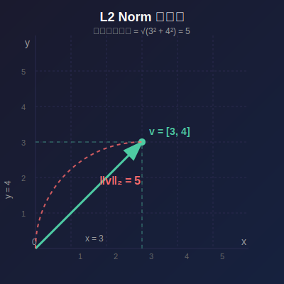

# L2 Norm (歐幾里得範數) 詳細解說

[🏠 返回目錄](../index.md)

L2 Norm，又稱為歐幾里得範數 (Euclidean norm) 或歐幾里得距離，是向量空間中衡量向量長度的一種方式。它在機器學習、深度學習、信號處理和許多工程領域中都有廣泛應用。

## 數學定義

對於一個 $n$ 維向量 $\mathbf{v} = [v_1, v_2, \dots, v_n]^T$，其 L2 norm 定義為各元素平方和的平方根：

$$\|\mathbf{v}\|_2 = \sqrt{\sum_{i=1}^{n} v_i^2} = \sqrt{v_1^2 + v_2^2 + \dots + v_n^2}$$

這本質上是在歐幾里得空間中，從原點 $(0, 0, \dots, 0)$ 到點 $(v_1, v_2, \dots, v_n)$ 的直線距離。

## Lp 範數家族

L2 norm 是更廣泛的 Lp 範數家族中的一員。對於任意 $p \geq 1$，Lp 範數定義為：

$$\|\mathbf{v}\|_p = \left(\sum_{i=1}^{n} |v_i|^p\right)^{1/p}$$

常見的特例包括：
- **L1 範數** ($p=1$)：$\|\mathbf{v}\|_1 = \sum_{i=1}^{n} |v_i|$（曼哈頓距離）
- **L2 範數** ($p=2$)：$\|\mathbf{v}\|_2 = \sqrt{\sum_{i=1}^{n} v_i^2}$（歐幾里得距離）
- **L∞ 範數** ($p\to\infty$)：$\|\mathbf{v}\|_\infty = \max_i |v_i|$（切比雪夫距離）

## 實例說明

### 二維向量範例

考慮一個 2 維向量 $\mathbf{v} = [3, 4]^T$：

$$\|\mathbf{v}\|_2 = \sqrt{3^2 + 4^2} = \sqrt{9 + 16} = \sqrt{25} = 5$$

這代表在二維平面上，從原點 $(0,0)$ 到點 $(3,4)$ 的直線長度為 5。

### 三維向量範例

考慮一個 3 維向量 $\mathbf{v} = [1, 2, 2]^T$：

$$\|\mathbf{v}\|_2 = \sqrt{1^2 + 2^2 + 2^2} = \sqrt{1 + 4 + 4} = \sqrt{9} = 3$$

### 高維向量範例

在機器學習中，我們經常處理高維向量。考慮一個 4 維特徵向量 $\mathbf{v} = [0.5, -0.3, 0.8, -0.1]^T$：

$$\|\mathbf{v}\|_2 = \sqrt{0.5^2 + (-0.3)^2 + 0.8^2 + (-0.1)^2} = \sqrt{0.25 + 0.09 + 0.64 + 0.01} = \sqrt{0.99} \approx 0.995$$

## 視覺化圖示

### 二維 L2 Norm 圖解



*(上圖展示了向量 [3, 4] 的長度，這構成了一個直角三角形的斜邊)*

## L2 Norm 在 TurboQuant 中的應用

在 TurboQuant 論文中，L2 norm 扮演著關鍵角色：

1. **MSE 失真度量**：均方誤差 (MSE) 定義為原始向量與重建向量之間的 L2 距離平方：

   $$D_{\text{mse}}:=\mathbb{E}_Q[\|\mathbf{x}-Q^{-1}(Q(\mathbf{x}))\|_2^2]$$

2. **殘差最小化**：TurboQuant 的 MSE 最佳量化器旨在最小化殘差的 L2 範數，從而最小化量化誤差。

3. **單位範數假設**：論文假設輸入向量具有單位 L2 範數 ($\|\mathbf{x}\|_2=1$)，這是向量量化中的標準假設。

## 單位向量 (Unit Vector)

一個重要的概念是**單位向量**，即 L2 範數為 1 的向量。任何非零向量 $\mathbf{v}$ 都可以通過除以其 L2 範數來標準化為單位向量：

$$\hat{\mathbf{v}} = \frac{\mathbf{v}}{\|\mathbf{v}\|_2}$$

這個過程稱為**標準化 (Normalization)** 或**歸一化**。

### 標準化範例

考慮向量 $\mathbf{v} = [3, 4]^T$，其 L2 範數為 5。標準化後：

$$\hat{\mathbf{v}} = \frac{[3, 4]^T}{5} = [0.6, 0.8]^T$$

驗證：$\|\hat{\mathbf{v}}\|_2 = \sqrt{0.6^2 + 0.8^2} = \sqrt{0.36 + 0.64} = \sqrt{1} = 1$ ✓

## 幾何解釋

L2 範數的幾何意義非常直觀：

| 維度 | 幾何解釋 |
|------|----------|
| 1D | 數軸上點到原點的距離 |
| 2D | 平面上點到原點的直線距離（畢達哥拉斯定理） |
| 3D | 三維空間中點到原點的直線距離 |
| nD | n 維歐幾里得空間中點到原點的距離 |

## 性質

L2 範數具有以下重要性質：

1. **非負性**：$\|\mathbf{v}\|_2 \geq 0$，且 $\|\mathbf{v}\|_2 = 0$ 若且唯若 $\mathbf{v} = \mathbf{0}$

2. **齊次性**：$\|\alpha\mathbf{v}\|_2 = |\alpha|\cdot\|\mathbf{v}\|_2$，對於任意純量 $\alpha$

3. **三角不等式**：$\|\mathbf{u} + \mathbf{v}\|_2 \leq \|\mathbf{u}\|_2 + \|\mathbf{v}\|_2$

4. **柯西 - 施瓦茨不等式**：$|\langle\mathbf{u}, \mathbf{v}\rangle| \leq \|\mathbf{u}\|_2 \cdot \|\mathbf{v}\|_2$

## Python 程式碼範例

```python
import numpy as np

# 計算 L2 norm
v = np.array([3, 4])
l2_norm = np.linalg.norm(v)  # 結果：5.0

# 標準化
v_normalized = v / l2_norm  # 結果：[0.6, 0.8]

# 驗證單位範數
print(np.linalg.norm(v_normalized))  # 結果：1.0
```

## 相關連結

- [向量量化解釋](03-vector-quantization-explanation.md)
- [均方誤差 (MSE) 解釋](03-mse-explanation.md)
- [內積失真](03-inner-product-distortion.md)

---

### 返回

[回到 TurboQuant 翻譯文件](03-turboquant-translation.md)
