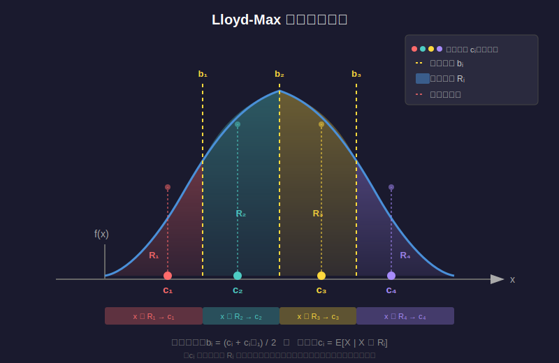
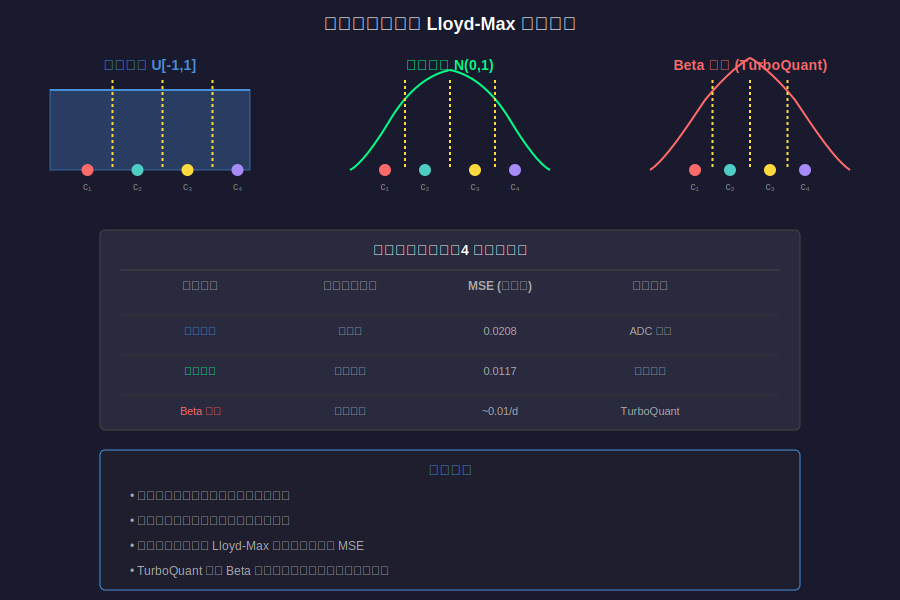

# Lloyd-Max 量化器詳細解說

> **相關連結：** 本文是針對 [TurboQuant 論文翻譯](03-turboquant-translation.md) 中提到的 [Lloyd-Max quantizer](#) 的詳細補充說明。

---

## 目錄

1. [什麼是 Lloyd-Max 量化器？](#什麼是-lloyd-max-量化器)
2. [歷史背景](#歷史背景)
3. [核心原理](#核心原理)
4. [Lloyd-Max 演算法](#lloyd-max-演算法)
5. [數學推導](#數學推導)
6. [實際範例](#實際範例)
7. [視覺化圖解](#視覺化圖解)
8. [在 TurboQuant 中的應用](#在 turboquant 中的應用)

---

## 什麼是 Lloyd-Max 量化器？

**Lloyd-Max 量化器**（又稱為 **Max-Lloyd 量化器** 或 **Lloyd 演算法**）是一種迭代演算法，用於設計**最佳純量量化器**（optimal scalar quantizer）。它的目標是找到一組最佳的**量化層級**（quantization levels）和**決策邊界**（decision boundaries），使得量化過程產生的**均方誤差（MSE）最小化**。

簡單來說，給定一個具有已知機率分佈的隨機變量，Lloyd-Max 演算法能夠找到最佳的「分桶」方式，讓每個桶的代表值（質心）和邊界都能最小化整體的量化誤差。

---

## 歷史背景

Lloyd-Max 演算法的起源可以追溯到兩位研究者的獨立工作：

| 年份 | 研究者 | 貢獻 |
|------|--------|------|
| 1957 | Stuart P. Lloyd | 在貝爾實驗室的內部技術報告中首次提出（1982 年正式發表） |
| 1960 | Joel Max | 在博士論文中獨立提出相同的演算法 |

由於兩人的獨立貢獻，這個演算法被命名為 **Lloyd-Max 演算法**（或 Max-Lloyd 演算法）。

---

## 核心原理

Lloyd-Max 量化器基於兩個關鍵的**最佳化條件**：

### 條件 1：最近鄰條件（Nearest Neighbor Condition）

對於給定的量化層級 $\{c_1, c_2, \ldots, c_N\}$，最佳的決策邊界應該位於相鄰量化層級的中點：

$$
b_i = \frac{c_i + c_{i+1}}{2}, \quad \text{for } i = 1, 2, \ldots, N-1
$$

其中 $b_i$ 是第 $i$ 個和第 $i+1$ 個量化層級之間的邊界。

### 條件 2：質心條件（Centroid Condition）

對於給定的決策邊界 $\{b_1, b_2, \ldots, b_{N-1}\}$，最佳的量化層級應該是每個區間內輸入值的**條件期望值**（質心）：

$$
c_i = \frac{\int_{b_{i-1}}^{b_i} x \cdot f_X(x) dx}{\int_{b_{i-1}}^{b_i} f_X(x) dx}
$$

其中 $f_X(x)$ 是輸入隨機變量 $X$ 的機率密度函數（PDF）。

### 直觀理解

這兩個條件可以直觀地理解為：

1. **最近鄰條件**：每個輸入值應該被量化到「最近」的量化層級
2. **質心條件**：每個量化層級應該是其對應區間內所有值的「平均」或「中心」

這與 **k-means 分群演算法** 非常相似，事實上，Lloyd-Max 演算法可以被視為**連續一維 k-means**。

---

## Lloyd-Max 演算法

### 演算法步驟

```
輸入：
  - 機率密度函數 f_X(x)
  - 量化層級數量 N
  - 初始量化層級 {c_1, c_2, ..., c_N}（或初始邊界）
  - 收斂閾值 ε

輸出：
  - 最佳量化層級 {c_1*, c_2*, ..., c_N*}
  - 最佳決策邊界 {b_1*, b_2*, ..., b_{N-1}*}

步驟：
1. 初始化量化層級 {c_1, c_2, ..., c_N}
2. 重複以下步驟直到收斂：
   a. 計算決策邊界：b_i = (c_i + c_{i+1}) / 2
   b. 計算新的量化層級（質心）：
      c_i = E[X | b_{i-1} ≤ X < b_i]
   c. 檢查收斂：如果量化層級的變化小於 ε，則停止
3. 返回最佳量化層級和邊界
```

### 偽代碼

```python
def lloyd_max(f_X, N, initial_centroids, epsilon=1e-6, max_iterations=1000):
    """
    Lloyd-Max 演算法實現
    
    參數:
        f_X: 機率密度函數
        N: 量化層級數量
        initial_centroids: 初始量化層級
        epsilon: 收斂閾值
        max_iterations: 最大迭代次數
    
    返回:
        centroids: 最佳量化層級
        boundaries: 最佳決策邊界
    """
    centroids = initial_centroids
    
    for iteration in range(max_iterations):
        # 步驟 1: 計算決策邊界（Voronoi 分割）
        boundaries = [(centroids[i] + centroids[i+1]) / 2 
                      for i in range(N-1)]
        boundaries = [-float('inf')] + boundaries + [float('inf')]
        
        # 步驟 2: 計算新的質心
        new_centroids = []
        for i in range(N):
            # 計算區間 [boundaries[i], boundaries[i+1]] 的質心
            numerator = integral(x * f_X(x), boundaries[i], boundaries[i+1])
            denominator = integral(f_X(x), boundaries[i], boundaries[i+1])
            new_centroids.append(numerator / denominator)
        
        # 步驟 3: 檢查收斂
        max_change = max(abs(new_centroids[i] - centroids[i]) 
                         for i in range(N))
        if max_change < epsilon:
            break
        
        centroids = new_centroids
    
    return centroids, boundaries[1:-1]  # 移除無限邊界
```

---

## 數學推導

### 問題形式化

給定一個隨機變量 $X$ 具有機率密度函數 $f_X(x)$，我們希望設計一個 $N$-層級的純量量化器，將 $X$ 映射到 $N$ 個離散值 $\{c_1, c_2, \ldots, c_N\}$。

量化過程定義為：
$$
Q(x) = c_i \quad \text{if } x \in [b_{i-1}, b_i)
$$

其中 $\{b_0, b_1, \ldots, b_N\}$ 是決策邊界，且 $b_0 = -\infty$，$b_N = +\infty$。

### 目標函數

我們的目標是最小化**均方量化誤差**（Mean Squared Quantization Error）：

$$
\text{MSE} = \mathbb{E}[(X - Q(X))^2] = \int_{-\infty}^{\infty} (x - Q(x))^2 f_X(x) dx
$$

將積分按決策區域分解：

$$
\text{MSE} = \sum_{i=1}^{N} \int_{b_{i-1}}^{b_i} (x - c_i)^2 f_X(x) dx
$$

### 最佳化條件推導

#### 推導 1：最佳決策邊界

對邊界 $b_i$ 求偏導數：

$$
\frac{\partial \text{MSE}}{\partial b_i} = (b_i - c_i)^2 f_X(b_i) - (b_i - c_{i+1})^2 f_X(b_i) = 0
$$

這意味著：
$$
(b_i - c_i)^2 = (b_i - c_{i+1})^2
$$

解得：
$$
b_i = \frac{c_i + c_{i+1}}{2}
$$

#### 推導 2：最佳量化層級

對量化層級 $c_i$ 求偏導數：

$$
\frac{\partial \text{MSE}}{\partial c_i} = -2 \int_{b_{i-1}}^{b_i} (x - c_i) f_X(x) dx = 0
$$

解得：
$$
c_i = \frac{\int_{b_{i-1}}^{b_i} x f_X(x) dx}{\int_{b_{i-1}}^{b_i} f_X(x) dx} = \mathbb{E}[X | b_{i-1} \leq X < b_i]
$$

---

## 實際範例

### 範例 1：均勻分佈的 2-位元量化

假設輸入 $X$ 服從均勻分佈 $U[-1, 1]$，我們希望設計一個 2-位元（4 層級）的 Lloyd-Max 量化器。

**步驟 1：初始化**

初始量化層級可以設為均勻分佈的分位數：
$$
c_1^{(0)} = -0.75, \quad c_2^{(0)} = -0.25, \quad c_3^{(0)} = 0.25, \quad c_4^{(0)} = 0.75
$$

**步驟 2：迭代**

對於均勻分佈，Lloyd-Max 演算法會收斂到：

| 量化層級 | 值 |
|---------|-----|
| $c_1^*$ | $-0.8165$ |
| $c_2^*$ | $-0.2887$ |
| $c_3^*$ | $0.2887$ |
| $c_4^*$ | $0.8165$ |

對應的決策邊界：

| 邊界 | 值 |
|------|-----|
| $b_1^*$ | $-0.5526$ |
| $b_2^*$ | $0$ |
| $b_3^*$ | $0.5526$ |

**步驟 3：計算 MSE**

最終的均方誤差為：
$$
\text{MSE} = \frac{1}{48} \approx 0.0208
$$

### 範例 2：高斯分佈的 3-位元量化

假設輸入 $X$ 服從標準常態分佈 $\mathcal{N}(0, 1)$，我們希望設計一個 3-位元（8 層級）的 Lloyd-Max 量化器。

由於高斯分佈是對稱的，我們只需要計算一半的量化層級，然後利用對稱性得到另一半。

**最佳量化層級**（數值計算結果）：

| 索引 | 量化層級 $c_i^*$ | 決策邊界 $b_i^*$ |
|------|-----------------|-----------------|
| 1 | $-2.466$ | $-\infty$ |
| 2 | $-1.671$ | $-2.068$ |
| 3 | $-1.079$ | $-1.375$ |
| 4 | $-0.572$ | $-0.826$ |
| 5 | $0.572$ | $0$ |
| 6 | $1.079$ | $0.826$ |
| 7 | $1.671$ | $1.375$ |
| 8 | $2.466$ | $2.068$ |

**MSE**：約為 $0.0117$

### 範例 3：Beta 分佈的量化（TurboQuant 應用）

在 TurboQuant 中，經過隨機旋轉後的向量座標服從 Beta 分佈：

$$
f_X(x) = \frac{\Gamma(d/2)}{\sqrt{\pi}\cdot\Gamma((d-1)/2)}(1-x^2)^{(d-3)/2}, \quad x \in [-1, 1]
$$

對於高維度 $d$，這個分佈近似於 $\mathcal{N}(0, 1/d)$。

**1-位元量化**（2 層級）的最佳解：
$$
c_1^* = -\sqrt{\frac{2}{\pi d}}, \quad c_2^* = \sqrt{\frac{2}{\pi d}}
$$

**2-位元量化**（4 層級）的最佳解（對於大 $d$）：
$$
c_1^* \approx -\frac{1.51}{\sqrt{d}}, \quad c_2^* \approx -\frac{0.453}{\sqrt{d}}, \quad c_3^* \approx \frac{0.453}{\sqrt{d}}, \quad c_4^* \approx \frac{1.51}{\sqrt{d}}
$$

---

## 視覺化圖解

### 圖 1：Lloyd-Max 量化器示意圖

下圖展示了 Lloyd-Max 量化器的基本概念：



### 圖 2：迭代收斂過程

Lloyd-Max 演算法的迭代過程如下圖所示：


### 圖 3：不同分佈的量化比較



---

## 在 TurboQuant 中的應用

在 [TurboQuant](03-turboquant-translation.md) 論文中，Lloyd-Max 量化器扮演著核心角色：

### TurboQuant 的 MSE 最佳化流程

1. **隨機旋轉**：將輸入向量 $\mathbf{x}$ 乘以隨機旋轉矩陣 $\mathbf{\Pi}$
   $$
   \mathbf{y} = \mathbf{\Pi} \cdot \mathbf{x}
   $$

2. **誘導 Beta 分佈**：旋轉後的向量座標 $\mathbf{y}_j$ 服從 Beta 分佈

3. **應用 Lloyd-Max**：對每個座標應用 Lloyd-Max 量化器
   $$
   \text{idx}_j = \arg\min_{k \in [2^b]} |\mathbf{y}_j - c_k|
   $$
   其中 $\{c_k\}$ 是透過 Lloyd-Max 演算法預先計算的最佳量化層級

4. **反向旋轉**：反量化時，將量化值旋轉回原始基底
   $$
   \tilde{\mathbf{x}} = \mathbf{\Pi}^\top \cdot \tilde{\mathbf{y}}
   $$

### 為什麼選擇 Lloyd-Max？

1. **最佳性**：Lloyd-Max 量化器在給定機率分佈下提供最小的 MSE
2. **效率**：一旦預先計算好碼本，量化過程非常快速
3. **適用性**：特別適合 TurboQuant 中誘導的 Beta 分佈

### 性能保證

根據 TurboQuant 論文的**定理 1**，使用 Lloyd-Max 量化器的 TurboQuant 達到以下失真界限：

$$
D_{\text{mse}} \leq \frac{3\pi}{2} \cdot \frac{1}{4^b}
$$

對於小的位元寬度：

| 位元寬度 $b$ | MSE 失真 $D_{\text{mse}}$ |
|-------------|--------------------------|
| 1 | $\approx 0.36$ |
| 2 | $\approx 0.117$ |
| 3 | $\approx 0.03$ |
| 4 | $\approx 0.009$ |

---

## 總結

Lloyd-Max 量化器是一種強大且優雅的演算法，透過簡單的迭代過程找到最佳的純量量化器。它在 TurboQuant 中發揮關鍵作用，使得在高維空間中進行接近最佳失真率的向量量化成為可能。

### 關鍵要點

1. **Lloyd-Max 演算法**透過交替更新決策邊界和量化層級來最小化 MSE
2. 等價於**連續一維 k-means** 演算法
3. 在 TurboQuant 中用於量化經過隨機旋轉後服從 Beta 分佈的向量座標
4. 提供**接近資訊理論下界**的失真率

---

## 參考文獻

1. Lloyd, S. P. (1982). "Least squares quantization in PCM". IEEE Transactions on Information Theory. 28 (2): 129–137.
2. Max, J. (1960). "Quantizing for minimum distortion". IRE Transactions on Information Theory. 6 (1): 7–12.
3. Gersho, A., & Gray, R. M. (1992). Vector Quantization and Signal Compression. Springer.
4. [TurboQuant 論文翻譯](03-turboquant-translation.md)

---

**返回連結：** [回到 TurboQuant 論文翻譯](03-turboquant-translation.md)
