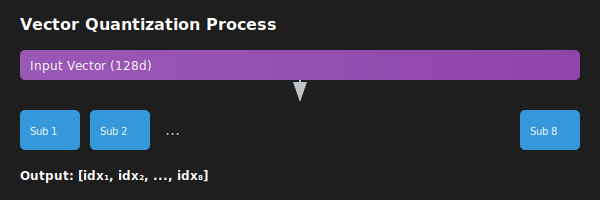

# 乘積量化 (Product Quantization, PQ) 詳細解說

[🏠 返回目錄](../index.md) | [返回 TurboQuant 論文翻譯](03-turboquant-translation.md)

---

## 什麼是乘積量化 (Product Quantization, PQ)？

乘積量化 (Product Quantization, PQ) 是一種用於高維向量壓縮的技術，常見於向量資料庫與最近鄰搜尋（Nearest Neighbor Search）應用中。

其核心思想是將高維空間切分為多個較小的子空間，然後分別對這些子空間進行量化。這種「分而治之」的方法能大幅減少儲存空間，同時在搜尋時保持不錯的效率與準確度。

### 數學原理與流程

假設我們有一個 $d$ 維向量 $\mathbf{x} \in \mathbb{R}^d$：

1. **切分 (Subspace Decomposition)**：
   將 $d$ 維向量切分為 $m$ 個子向量 $\mathbf{x}_1, \mathbf{x}_2, \ldots, \mathbf{x}_m$，每個子向量維度為 $d/m$。
   
   $$\mathbf{x} = [\mathbf{x}_1, \mathbf{x}_2, \ldots, \mathbf{x}_m]$$

2. **訓練碼本 (Codebook Training)**：
   對每個子空間分別使用 K-means 演算法訓練一個碼本 (Codebook)。
   假設每個子空間有 $k$ 個質心（Codebook size），則總共有 $m \times k$ 個質心。

3. **量化 (Quantization)**：
   對於每個子向量 $\mathbf{x}_i$，尋找碼本中最接近的質心索引 (Index)。
   最終，原始的浮點數向量 $\mathbf{x}$ 被表示為一組索引序列 $[idx_1, idx_2, \ldots, idx_m]$。

## 舉例說明

假設我們有一個 128 維的向量，我們想用 PQ 將其壓縮。

- **切分**：將其切分為 $m=8$ 個子向量，每個子向量維度為 $128/8 = 16$。
- **碼本**：為每個 16 維的子空間訓練 256 個質心 ($k=256$)。
- **量化**：每個子向量可以用 8 個位元 (bits) 來表示（因為 $2^8 = 256$）。
- **結果**：原本需要 $128 \times 4 = 512$ bytes 的向量，現在只需要 $8 \times 1 = 8$ bytes (每個子向量 1 byte)。

## 圖示 (SVG)

*(註：此圖展示了向量切分、碼本量化與索引生成的流程。)*

---

## 與 TurboQuant 的關聯

在 [TurboQuant 論文翻譯](03-turboquant-translation.md) 中，我們提到 PQ 是一種常見的向量量化技術。TurboQuant 旨在克服傳統 PQ 需要進行離線訓練 (data-dependent) 的缺點，透過隨機旋轉與線上純量量化（Scalar Quantization），實現了數據無知 (data-oblivious) 的量化方法，在保持高效的同時提供了更好的失真率界限。

[返回 TurboQuant 論文翻譯](03-turboquant-translation.md)
