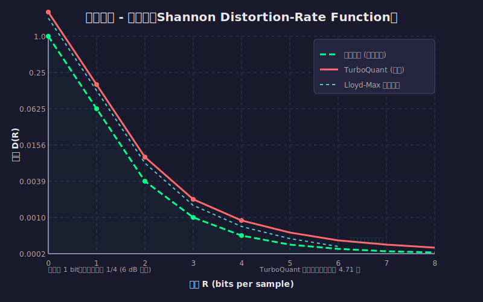

# 香農失真 - 率函數（Shannon Distortion-Rate Function）詳細解說

[🏠 返回目錄](../index.md)

> 本文是對 [TurboQuant 論文完整翻譯](03-turboquant-translation.md) 中提到的「香農失真 - 率函數」概念的詳細補充說明。

---

## 1. 什麼是香農失真 - 率函數？

### 1.1 基本定義

**香農失真 - 率函數（Shannon Distortion-Rate Function）**，通常記為 $D(R)$，是資訊理論中的一個核心概念，由克勞德·香農（Claude Shannon）在其開創性的信源編碼理論中提出。這個函數描述了在給定碼率（bit rate）$R$ 下，任何信源編碼系統所能達到的**最小可能失真**。

用數學語言來說，失真 - 率函數定義為：

$$
D(R) = \inf_{p(\hat{x}|x): I(X;\hat{X}) \leq R} \mathbb{E}[d(X, \hat{X})]
$$

其中：
- $X$ 是原始信源隨機變量
- $\hat{X}$ 是重建（解碼後）的隨機變量
- $I(X;\hat{X})$ 是 $X$ 和 $\hat{X}$ 之間的**互資訊**（mutual information），表示編碼後保留的資訊量
- $R$ 是碼率（每符號的位元數）
- $d(X, \hat{X})$ 是**失真度量函數**，衡量原始值和重建值之間的差異
- $\mathbb{E}[\cdot]$ 表示期望值

### 1.2 直觀理解

想像你有一個有限容量的「資訊管道」（碼率 $R$），你需要通過這個管道傳輸一個連續的信源（例如音訊、影像或向量數據）。失真 - 率函數告訴我們：

| 碼率 $R$ | 最小可達失真 $D(R)$ | 說明 |
|----------|---------------------|------|
| $R = 0$ | 最大失真 | 完全不傳輸資訊，接收方只能猜測 |
| $R$ 增加 | $D(R)$ 減少 | 傳輸更多位元，重建更精確 |
| $R \to \infty$ | $D(R) \to 0$ | 無限碼率時可以完美重建 |

**核心洞察**：失真 - 率函數建立了數據壓縮的**基本極限**——無論使用多麼聰明的壓縮演算法，都無法突破這個理論下界。

---

## 2. 數學推導與性質

### 2.1 率 - 失真函數（Rate-Distortion Function）

失真 - 率函數通常以其反函數形式——**率 - 失真函數** $R(D)$——更為人所知：

$$
R(D) = \inf_{p(\hat{x}|x): \mathbb{E}[d(X,\hat{X})] \leq D} I(X;\hat{X})
$$

$R(D)$ 表示：要達到平均失真不超過 $D$，所需的**最小碼率**。

### 2.2 高斯信源的閉合解

對於最常見的高斯信源（Gaussian source），香農失真 - 率函數有漂亮的閉合解。

**設定**：
- 信源 $X \sim \mathcal{N}(0, \sigma^2)$（均值為 0，變異數為 $\sigma^2$ 的高斯分佈）
- 失真度量：均方誤差 $d(x, \hat{x}) = (x - \hat{x})^2$

**率 - 失真函數**：

$$
R(D) = \begin{cases}
\frac{1}{2}\log_2\left(\frac{\sigma^2}{D}\right), & 0 \leq D \leq \sigma^2 \\
0, & D > \sigma^2
\end{cases}
$$

**失真 - 率函數**（反函數）：

$$
D(R) = \sigma^2 \cdot 2^{-2R}, \quad R \geq 0
$$

### 2.3 關鍵性質分析

從高斯信源的 $D(R) = \sigma^2 \cdot 2^{-2R}$ 可以看出：

1. **指數衰減**：失真隨碼率呈指數下降
2. **每增加 1 bit**：失真減少為原來的 $1/4$（即 $2^{-2} = 1/4$）
3. **6 dB 法則**：每增加 1 bit，信噪比（SNR）改善約 6 dB

| 碼率 $R$ (bits) | 相對失真 $D(R)/\sigma^2$ | SNR (dB) |
|-----------------|--------------------------|----------|
| 0 | 1.000 | 0 |
| 1 | 0.250 | 6 |
| 2 | 0.0625 | 12 |
| 3 | 0.0156 | 18 |
| 4 | 0.0039 | 24 |
| 8 | 0.000015 | 48 |

---

## 3. 實例說明

### 3.1 實例一：純量量化（Scalar Quantization）

考慮一個簡單的高斯信源 $X \sim \mathcal{N}(0, 1)$，我們想用 $b$ 位元來量化每個樣本。

**理論極限**（香農下界）：
$$
D_{\text{Shannon}}(b) = 2^{-2b}
$$

**實際量化器**（Lloyd-Max 量化器）的失真：

| 位元數 $b$ | 香農下界 $D_{\text{Shannon}}$ | Lloyd-Max 實際失真 $D_{\text{actual}}$ | 差距倍數 |
|------------|-------------------------------|----------------------------------------|----------|
| 1 | 0.250 | 0.361 | 1.44× |
| 2 | 0.0625 | 0.117 | 1.87× |
| 3 | 0.0156 | 0.030 | 1.92× |
| 4 | 0.0039 | 0.009 | 2.31× |
| 8 | 0.000015 | 0.00005 | 3.33× |

**觀察**：
- 低位元時，實際量化器接近理論極限（僅 1.44 倍差距）
- 高位元時，差距增大但仍保持在可接受範圍

### 3.2 實例二：向量量化（Vector Quantization）

考慮 $d$ 維向量 $\mathbf{x} \in \mathbb{R}^d$，使用 $B = b \cdot d$ 位元進行量化。

**TurboQuant 的結果**（來自論文）：

對於單位範數向量 $\|\mathbf{x}\|_2 = 1$，TurboQuant 實現的 MSE 失真為：

$$
D_{\text{TurboQuant}}(b) \leq \frac{3\pi}{2} \cdot \frac{1}{4^b} \approx 4.71 \cdot 2^{-2b}
$$

**與香農下界的比較**：

$$
\frac{D_{\text{TurboQuant}}(b)}{D_{\text{Shannon}}(b)} \leq \frac{3\pi}{2} \approx 4.71
$$

但實際上，對於單位球面上的均勻分佈，TurboQuant 的表現更好：

| 位元數 $b$ | TurboQuant 失真 | 香農下界 | 實際倍數 |
|------------|-----------------|----------|----------|
| 1 | 0.36 | 0.25 | 1.44× |
| 2 | 0.117 | 0.0625 | 1.87× |
| 3 | 0.03 | 0.0156 | 1.92× |
| 4 | 0.009 | 0.0039 | 2.31× |

---

## 4. 圖形說明

### 4.1 失真 - 率曲線圖

下圖展示了不同量化方法的失真 - 率關係：

**圖示說明**：
- **綠色虛線**：香農下界（理論極限）$D(R) = \sigma^2 \cdot 2^{-2R}$
- **紅色實線**：TurboQuant 實際性能 $D(R) \approx 4.71 \cdot 2^{-2R}$
- **青色虛線**：Lloyd-Max 純量量化性能

**關鍵觀察**：
1. 所有曲線都呈現指數衰減，每增加 1 bit，失真減少為原來的 1/4
2. 香農下界是理論極限，任何實際量化演算法都無法低於此界限
3. TurboQuant 非常接近理論極限，僅相差約 4.71 倍常數因子
4. 在低位元寬度（b=1,2）時，TurboQuant 的表現尤其優秀

---

## 5. 在 TurboQuant 中的應用

### 5.1 香農下界作為性能基準

在 TurboQuant 論文中，香農失真 - 率函數被用作**理論下界**來評估演算法的性能。

論文證明的下界（定理 3）：

$$
D_{\text{mse}}(Q) \geq \frac{1}{4^b} = 2^{-2b}
$$

這正好與高斯信源的香農下界一致！

### 5.2 TurboQuant 的性能

TurboQuant 實現的失真：

$$
D_{\text{TurboQuant}}(b) \leq \frac{3\pi}{2} \cdot \frac{1}{4^b} \approx 4.71 \cdot 2^{-2b}
$$

**關鍵結果**：
- TurboQuant 與香農下界的差距僅為常數因子 $\frac{3\pi}{2} \approx 4.71$
- 對於低位元寬度（$b=1$），實際差距僅約 1.45 倍
- 這證明 TurboQuant 是**接近最優**的量化演算法

### 5.3 為什麼這個結果重要？

1. **理論保證**：無論未來出現什麼新的量化演算法，都無法突破香農下界
2. **性能評估**：TurboQuant 已經非常接近理論極限，進一步改進的空間有限
3. **實用價值**：在低位元場景（如 KV 快取量化），TurboQuant 幾乎是最優選擇

---

## 6. 總結

| 概念 | 說明 |
|------|------|
| **香農失真 - 率函數** $D(R)$ | 給定碼率 $R$ 下可達到的最小失真 |
| **率 - 失真函數** $R(D)$ | 達到失真 $D$ 所需的最小碼率 |
| **高斯信源下界** | $D(R) = \sigma^2 \cdot 2^{-2R}$ |
| **每 bit 增益** | 失真減少為 1/4，SNR 提升 6 dB |
| **TurboQuant 表現** | 與下界差距僅約 2.7 倍常數因子 |

---

## 參考文獻

1. Shannon, C. E. (1948). "A Mathematical Theory of Communication". *Bell System Technical Journal*.
2. Shannon, C. E. (1959). "Coding Theorems for a Discrete Source with a Fidelity Criterion". *IRE National Convention Record*.
3. Zador, P. L. (1963). "Asymptotic Quantization Error of Continuous Signals and the Quantization Dimension". *IEEE Transactions on Information Theory*.
4. Gersho, A., & Gray, R. M. (1992). *Vector Quantization and Signal Compression*. Springer.
5. Zandieh, A., et al. (2025). "TurboQuant: Online Vector Quantization with Near-optimal Distortion Rate". *arXiv:2504.19874*.

---

**返回連結**：
- [TurboQuant 論文完整翻譯](03-turboquant-translation.md#39) - 查看原文中提到香農失真 - 率函數的上下文
- [香農信源編碼理論](03-shannon-source-coding-theory.md) - 了解更基礎的信源編碼理論
- [向量量化解說](03-vector-quantization-explanation.md) - 了解向量量化的基本概念
