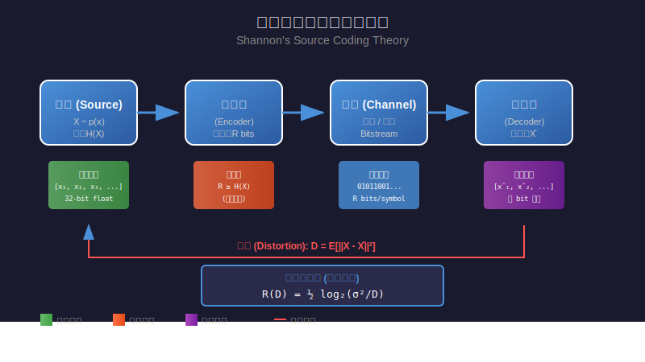

# Shannon's Source Coding Theory - 詳細解說

> **相關文件：** 本頁是對 [`03-shannon-source-coding-theory.md`](03-shannon-source-coding-theory.md) 的詳細補充說明
> 
> **原始出處：** 此詳細解說源自 [`03-turboquant-translation.md`](03-turboquant-translation.md:39) 第 39 行提到的 "Shannon's seminal work on Source Coding theory"

---

## 1. 歷史背景與重要性

克勞德·香農 (Claude Shannon) 於 1948 年發表了劃時代的論文《A Mathematical Theory of Communication》，奠定了現代資訊理論的基礎。這篇論文引入了**信源編碼理論** (Source Coding Theory)，解決了一個根本性的問題：

> **數據壓縮的極限是什麼？**

香農證明了存在一個理論上的壓縮極限，這個極限由數據本身的統計特性決定，與使用的壓縮演算法無關。

---

## 2. 核心概念詳解

### 2.1 資訊熵 (Information Entropy)

**定義：** 資訊熵 $H(X)$ 衡量一個隨機變數 $X$ 的平均不確定性或資訊含量（單位為 **bits**）。

對於一個離散隨機變數 $X$，其概率分佈為 $p(x)$，熵定義為：

$$H(X) = -\sum_{x \in \mathcal{X}} p(x) \log_2 p(x)$$

**KV Cache 範例：**
- **高熵 (High Entropy)**：假設 KV Cache 的數值分佈非常均勻（例如在 $[-1, 1]$ 範圍內每個數值出現機率相等），這意味著數值極難預測，壓縮難度極大，需要較高的位元數來保留資訊。
- **低熵 (Low Entropy)**：假設 KV Cache 的數值分佈非常集中（例如大部分數值都接近 $0$，僅有少數極端離群值），這意味著數值具有高度可預測性，因此可以透過量化技術（如 TurboQuant）使用較少的位元來表示。

### 2.2 信源編碼定理 (Source Coding Theorem)

**定理內容：** 對於一個熵為 $H(X)$ 的信源，存在一種編碼方式，使得平均每個符號的編碼長度 $L$ 滿足：

$$H(X) \le L < H(X) + \epsilon$$

其中 $\epsilon$ 是任意小的正數。

**KV Cache 範例：**
- 如果經過分析發現某個 KV Cache 維度的資訊熵 $H(X)$ 為 $3.5$ bits，那麼根據定理，我們**不可能**在不損失任何精度的情況下，將其壓縮到低於 $3.5$ bits 的長度。這為 KV Cache 的無損壓縮設定了理論極限。

**重要推論：**
- **不可能**將數據壓縮到小於其熵的大小而無損失
- 熵 $H(X)$ 是**無損壓縮的理論極限**

### 2.3 失真率函數 (Distortion-Rate Function)

在**有損壓縮**的情況下，香農引入了失真率函數 $R(D)$，它描述了在允許一定失真 $D$ 的情況下，所需的最小編碼率 $R$。

對於高斯信源和均方誤差 (MSE) 失真度量：

$$R(D) = \begin{cases} \frac{1}{2}\log_2\left(\frac{\sigma^2}{D}\right), & 0 \le D \le \sigma^2 \\ 0, & D > \sigma^2 \end{cases}$$

其中 $\sigma^2$ 是信源的變異數。

**KV Cache 範例：**
- 在 KV Cache 的**有損壓縮**（如 4-bit 量化）中，我們允許一定的量化誤差（失真 $D$）。
- 如果我們希望降低記憶體佔用（降低編碼率 $$R$$），我們就必須接受更大的失真 $D$（即更大的 MSE）。
- 失真率函數 $R(D)$ 告訴我們，在給定的 MSE 容忍度下，KV Cache 最少需要多少位元才能維持其特徵。

---

## 3. 實際範例說明

### 範例 1：英文字母的熵計算

考慮一個簡化的模型，假設英文字母只有 4 個：{A, B, C, D}，其出現概率如下：

| 字母 | 概率 $p(x)$ | $-\log_2 p(x)$ | 貢獻 $p(x) \cdot (-\log_2 p(x))$ |
|------|-------------|----------------|----------------------------------|
| A    | 0.5         | 1.0            | 0.5                              |
| B    | 0.25        | 2.0            | 0.5                              |
| C    | 0.125       | 3.0            | 0.375                            |
| D    | 0.125       | 3.0            | 0.375                            |

**熵計算：**
$$H(X) = 0.5 + 0.5 + 0.375 + 0.375 = 1.75 \text{ bits}$$

這意味著，理論上每個字母平均只需要 1.75 位元就能表示，而不是固定的 2 位元（4 個字母需要 $\log_2 4 = 2$ 位元）。

### 範例 2：Huffman 編碼實作

基於上述概率分佈，Huffman 編碼會產生如下編碼：

| 字母 | 概率 | Huffman 編碼 | 碼長 |
|------|------|--------------|------|
| A    | 0.5  | `0`          | 1    |
| B    | 0.25 | `10`         | 2    |
| C    | 0.125| `110`        | 3    |
| D    | 0.125| `111`        | 3    |

**平均碼長：**
$$L = 0.5 \times 1 + 0.25 \times 2 + 0.125 \times 3 + 0.125 \times 3 = 1.75 \text{ bits}$$

這正好等於熵 $H(X)$，達到了理論最優！

---

## 4. 向量量化與香農理論的關係

在 TurboQuant 的脈絡中，向量量化 (Vector Quantization) 本質上是一種**有損壓縮**技術。香農的信源編碼理論為向量量化提供了理論基礎：

### 4.1 最佳失真率

香農證明了對於任何向量量化器，存在一個**資訊理論下界**，描述了在給定編碼率 $R$（位元數）下可達到的最小失真 $D$：

$$D(R) \ge \sigma^2 \cdot 2^{-2R}$$

其中：
- $D(R)$ 是在率 $R$ 下的最小失真
- $\sigma^2$ 是輸入信號的變異數
- $R$ 是每個樣本的位元數

### 4.2 TurboQuant 的貢獻

TurboQuant 的創新在於：
1. **接近理論極限**：TurboQuant 實現的失真率與香農下界僅相差約 2.7 倍
2. **線上應用**：演算法是 data-oblivious（數據無知）的，適合即時應用
3. **通用性**：適用於所有位元寬度和維度

---

## 5. 視覺化說明

下圖展示了香農信源編碼理論的核心概念：

### 圖示說明：

1. **信源 (Source)**：產生需要壓縮的原始數據（如模型參數、KV Cache）
2. **編碼器 (Encoder)**：將原始數據轉換為緊湊的編碼表示
3. **通道 (Channel)**：傳輸或存儲壓縮後的數據
4. **解碼器 (Decoder)**：從編碼中重建原始數據
5. **失真 (Distortion)**：重建數據與原始數據之間的誤差

---

## 6. 在深度學習中的應用

### 6.1 KV Cache 量化

在大型語言模型 (LLM) 中，KV Cache 佔用大量記憶體。香農理論告訴我們：

- KV Cache 的熵決定了**理論最小壓縮大小**
- 使用向量量化可以接近這個理論極限
- TurboQuant 實現了每通道 3.5 位元的**品質中性**量化

### 6.2 模型壓縮

神經網絡參數的量化也可以從香農理論中受益：

| 量化方法 | 位元數 | 相對失真 | 與香農極限的差距 |
|----------|--------|----------|------------------|
| 純量量化 | 8-bit  | 高       | 大               |
| 向量量化 | 4-bit  | 中       | 中               |
| TurboQuant | 3.5-bit | 低    | 小 (≈2.7x)       |

---

## 7. 數學推導：高斯信源的失真率函數

對於一個方差為 $\sigma^2$ 的高斯信源 $X \sim \mathcal{N}(0, \sigma^2)$，在均方誤差失真度量下：

**失真率函數：**
$$R(D) = \frac{1}{2}\log_2\left(\frac{\sigma^2}{D}\right)$$

**逆函數（失真 - 率函數）：**
$$D(R) = \sigma^2 \cdot 2^{-2R}$$

**推導過程：**

1. 高斯分佈的微分熵為：$h(X) = \frac{1}{2}\log_2(2\pi e \sigma^2)$

2. 在失真約束 $E[(X-\hat{X})^2] \le D$ 下，條件熵的最大值在誤差為高斯分佈時達到

3. 互資訊 $I(X;\hat{X}) = h(X) - h(X|\hat{X})$ 的最小值為：
   $$R(D) = \frac{1}{2}\log_2\left(\frac{\sigma^2}{D}\right)$$

---

## 8. 總結

| 概念 | 公式 | 意義 |
|------|------|------|
| 資訊熵 | $H(X) = -\sum p(x)\log_2 p(x)$ | 無損壓縮極限 |
| 失真率函數 | $R(D) = \frac{1}{2}\log_2(\frac{\sigma^2}{D})$ | 有損壓縮的率 - 失真權衡 |
| 最佳向量量化 | $D(R) = \sigma^2 \cdot 2^{-2R}$ | 給定位元數下的最小失真 |

香農的信源編碼理論為現代數據壓縮技術提供了堅實的理論基礎，TurboQuant 等先進量化方法正是建立在這個基礎之上，不斷逼近理論極限。

---

## 參考文獻

1. Shannon, C. E. (1948). "A Mathematical Theory of Communication". Bell System Technical Journal.
2. Cover, T. M., & Thomas, J. A. (2006). "Elements of Information Theory". Wiley.
3. Zandieh, A., et al. (2025). "TurboQuant: Online Vector Quantization with Near-optimal Distortion Rate". arXiv:2504.19874.

---

> **返回連結：**
> - [回到 TurboQuant 論文翻譯](03-turboquant-translation.md)
> - [回到香農信源編碼理論簡介](03-shannon-source-coding-theory.md)
> - [了解向量量化](03-vector-quantization-explanation.md)
> - [了解均方誤差 (MSE)](03-mse-explanation.md)
