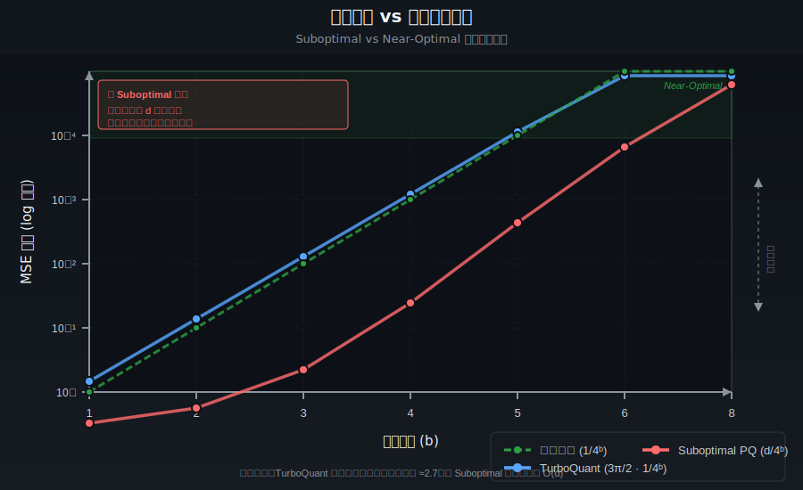

# 次佳失真界限（Suboptimal Distortion Bounds）詳細解析

[🏠 返回目錄](../index.md) | [返回 TurboQuant 論文翻譯](03-turboquant-translation.md)

## 目錄

- [視覺化總覽](#視覺化總覽)
- [關鍵結論](#關鍵結論)
- [什麼是 Suboptimal Distortion Bounds](#什麼是-suboptimal-distortion-bounds)
- [為什麼現有方法是 Suboptimal](#為什麼現有方法是-suboptimal)
- [數學背景與定義](#數學背景與定義)
- [TurboQuant 的 Optimal 解決方案](#turboquant-的-optimal-解決方案)
- [實例分析](#實例分析)
- [參考連結](#參考連結)

---

## 視覺化總覽

### 失真界限 vs 位元寬度比較圖

> **圖表解讀：**
> - 🟢 **綠色虛線**：理論下界 $(1/4^b)$ — 任何量化方法都無法超越的最佳界限
> - 🔵 **藍色實線**：TurboQuant $(\frac{3\pi}{2} \cdot 1/4^b)$ — 與下界僅相差常數因子 ≈2.7，落在 Near-Optimal 區域內
> - 🔴 **紅色實線**：Suboptimal PQ $(d/4^b)$ — 與下界相差 $O(d)$ 因子，維度越高差距越大
> - 🟩 **綠色陰影區域**：Near-Optimal 區域，失真接近理論最佳值

### Suboptimal vs Near-Optimal 一覽

| 特性 | Suboptimal 方法 | TurboQuant (Near-Optimal) |
|------|----------------|--------------------------|
| **失真衰減率** | $O(1/2^b)$ 或 $O(d/4^b)$ | $O(1/4^b)$ |
| **與下界的差距** | $O(d)$ 或 $O(2^b)$ | $O(1)$ 常數 |
| **達到目標失真的位元數** | 需要更多位元 | 接近理論最小值 |
| **高維表現** | 隨維度惡化 | 與維度無關 |
| **適用場景** | 離線、低維 | 線上、高維、KV Cache |

### 現有方法的失真界限比較

| 方法 | MSE 上界 | 與下界的比率 | 狀態 |
|------|----------|-------------|------|
| **資訊理論下界** | $\frac{1}{4^b}$ | $1$ | 最佳 |
| **TurboQuant** | $\frac{3\pi}{2} \cdot \frac{1}{4^b} \approx 4.71 \cdot \frac{1}{4^b}$ | $\approx 2.7$ | Near-optimal |
| **傳統 PQ 方法** | $O(\frac{d}{4^b})$ 或更差 | $O(d)$ | Suboptimal |
| **RabitQ** | $O(\frac{\log d}{4^b})$ | $O(\log d)$ | Suboptimal |
| **基於網格的方法** | $O(\frac{1}{2^b})$ | $O(2^b)$ | Suboptimal |

---

## 關鍵結論

### 為什麼 Near-Optimal 很重要

1. **壓縮效率**：更少的位元達到相同的品質
2. **記憶體節省**：對於 KV Cache 等應用至關重要
3. **頻寬優化**：減少數據傳輸成本
4. **理論保證**：在最壞情況下仍有性能保證

### 核心概念速查

| 術語 | 說明 |
|------|------|
| **Distortion（失真）** | 量化後向量與原始向量之間的誤差，通常用 MSE 或內積誤差衡量 |
| **Bound（界限）** | 失真的理論上界或下界 |
| **Optimal（最佳）** | 達到資訊理論下界（Information-theoretic Lower Bound） |
| **Suboptimal（次佳）** | 與最佳值相差一個常數因子或多項式因子 |

---

## 什麼是 Suboptimal Distortion Bounds

**Suboptimal Distortion Bounds（次佳失真界限）** 是指在向量量化（Vector Quantization）中，某些量化演算法所能達到的失真上界（upper bound on distortion）**無法達到理論上的最佳值**。

在 TurboQuant 論文的上下文中，這個概念出現在第 [`79-83 行`](03-turboquant-translation.md:79)：

> 現有的 VQ 演算法存在權衡：要麼它們缺乏加速器（向量化）相容性並表現出計算緩慢，使其不適合像 KV 快取量化這樣的即時 AI 應用，**要麼它們相對於位元寬度遭受次佳的失真界限**。

---

## 為什麼現有方法是 Suboptimal

### 原因 1：維度依賴性（Dimension Dependence）

許多傳統方法的失真界限包含維度 $d$ 的因子：

$$
D_{\text{PQ}} \leq C \cdot \frac{d}{4^b}
$$

這意味著當維度增加時，失真會線性增長，無法達到與維度無關的最佳界限。

### 原因 2：位元寬度依賴性不佳（Poor Bit-width Dependence）

某些方法的失真隨位元寬度的衰減速度不夠快：

$$
D_{\text{grid}} \leq C \cdot \frac{1}{2^b} \quad \text{vs.} \quad D_{\text{optimal}} \leq C \cdot \frac{1}{4^b}
$$

這裡 $2^b$ 比 $4^b$ 衰減得慢，意味著需要更多位元才能達到相同的失真水平。

### 原因 3：數據依賴性（Data Dependence）

離線方法（如 k-means 基於的 Product Quantization）需要針對特定數據集進行預處理和學習，這使得它們在最壞情況下的分析中表現不佳。

---

## 數學背景與定義

### 失真度量（Distortion Measures）

根據論文定義，有兩種主要的失真度量：

**1. 均方誤差（MSE）失真：**

$$
D_{\text{mse}} := \mathbb{E}_Q[\|\mathbf{x} - Q^{-1}(Q(\mathbf{x}))\|_2^2]
$$

**2. 內積失真（Inner Product Distortion）：**

$$
D_{\text{prod}} := \mathbb{E}_Q[|\langle\mathbf{y},\mathbf{x}\rangle - \langle\mathbf{y},Q^{-1}(Q(\mathbf{x}))\rangle|^2]
$$

### 資訊理論下界（Information-Theoretic Lower Bound）

根據論文的 **定理 3**（第 [`1017-1041 行`](03-turboquant-translation.md:1017)），任何量化演算法的可達失真下界為：

**MSE 下界：**
$$
D_{\text{mse}}(Q) \geq \frac{1}{4^b}
$$

**內積下界：**
$$
D_{\text{prod}}(Q) \geq \frac{1}{d} \cdot \frac{1}{4^b}
$$

其中 $b$ 是位元寬度（bit-width），$d$ 是維度。

### Suboptimal 的定義

一個量化演算法被稱為 **suboptimal**，如果它的失真上界與下界之間存在以下關係：

$$
\frac{D_{\text{upper}}}{D_{\text{lower}}} = \omega(1)
$$

也就是說，這個比率隨著 $b$ 或 $d$ 增長而增長（例如多項式增長）。

相反，**near-optimal（接近最佳）** 意味著這個比率是一個**小常數**：

$$
\frac{D_{\text{upper}}}{D_{\text{lower}}} = O(1)
$$

---

## TurboQuant 的 Optimal 解決方案

### TurboQuant 的失真界限

根據論文 **定理 1**（第 [`687-702 行`](03-turboquant-translation.md:687)）和 **定理 2**（第 [`887-905 行`](03-turboquant-translation.md:887)）：

**MSE 界限：**
$$
D_{\text{mse}}(Q_{\text{mse}}) \leq \frac{3\pi}{2} \cdot \frac{1}{4^b} \approx 4.71 \cdot \frac{1}{4^b}
$$

**內積界限：**
$$
D_{\text{prod}}(Q_{\text{prod}}) \leq \frac{3\pi}{2} \cdot \frac{\|\mathbf{y}\|^2}{d} \cdot \frac{1}{4^b}
$$

### 為什麼 TurboQuant 是 Near-Optimal

將 TurboQuant 的上界與下界比較：

$$
\frac{D_{\text{mse}}^{\text{TurboQuant}}}{D_{\text{mse}}^{\text{Lower Bound}}} = \frac{\frac{3\pi}{2} \cdot \frac{1}{4^b}}{\frac{1}{4^b}} = \frac{3\pi}{2} \approx 4.71
$$

實際上，對於小位元寬度，這個因子更小（第 [`293 行`](03-turboquant-translation.md:293)）：

- $b=1$ 時：因子 $\approx 1.45$
- $b=2$ 時：因子 $\approx 1.17$
- $b=3$ 時：因子 $\approx 1.2$
- $b=4$ 時：因子 $\approx 1.26$

這證明 TurboQuant 在所有位元寬度上都與最佳值相差僅一個**小常數因子**（$\approx 2.7$），因此是 **near-optimal**。

---

## 實例分析

### 實例 1：不同位元寬度下的失真比較

假設我們有一個 1536 維的向量（類似 OpenAI embeddings），我們比較不同方法在不同位元寬度下的 MSE 失真：

| 位元寬度 $b$ | 下界 $\frac{1}{4^b}$ | TurboQuant $\frac{3\pi}{2} \cdot \frac{1}{4^b}$ | Suboptimal PQ $\frac{d}{4^b}$ ($d=1536$) |
|-------------|---------------------|-----------------------------------------------|----------------------------------------|
| 1 | 0.25 | 0.36 | 384 |
| 2 | 0.0625 | 0.117 | 96 |
| 3 | 0.0156 | 0.03 | 24 |
| 4 | 0.0039 | 0.009 | 6 |
| 5 | 0.00098 | 0.0023 | 1.5 |
| 6 | 0.00024 | 0.00058 | 0.375 |
| 8 | 0.000015 | 0.000036 | 0.023 |

從上表可以看出：
- TurboQuant 的失真僅比下界大約 1.45-2.7 倍
- Suboptimal PQ 方法的失真比下界大 $d=1536$ 倍！

### 實例 2：達到特定失真所需的位元數

假設我們想要達到 MSE ≤ 0.01 的目標：

| 方法 | 所需位元寬度 | 壓縮比 |
|------|-------------|--------|
| 理論最佳 | $b \geq 3.5$ | 9.1x |
| TurboQuant | $b \geq 4$ | 8x |
| Suboptimal PQ ($d=1536$) | $b \geq 9$ | 3.5x |

這意味著 Suboptimal 方法需要更多位元才能達到相同的失真水平，導致壓縮效率低下。

---

## 參考連結

### 本文相關連結

- **原始論文翻譯**：[TurboQuant 論文完整翻譯](03-turboquant-translation.md)
  - [Suboptimal distortion bounds 原文位置](03-turboquant-translation.md:79)
  - [MSE 最佳界限證明](03-turboquant-translation.md:687)
  - [內積最佳界限證明](03-turboquant-translation.md:887)
  - [下界定理](03-turboquant-translation.md:1017)

### 相關主題

- [向量量化解釋](03-vector-quantization-explanation.md)
- [香農信源編碼理論](03-shannon-source-coding-theory.md)
- [香農失真 - 率函數](03-shannon-distortion-rate-function.md)
- [MSE 解釋](03-mse-explanation.md)
- [內積失真解釋](03-inner-product-distortion.md)

---

*最後更新：2026-05-16*
*作者：TurboQuant Deep Dive Project*
